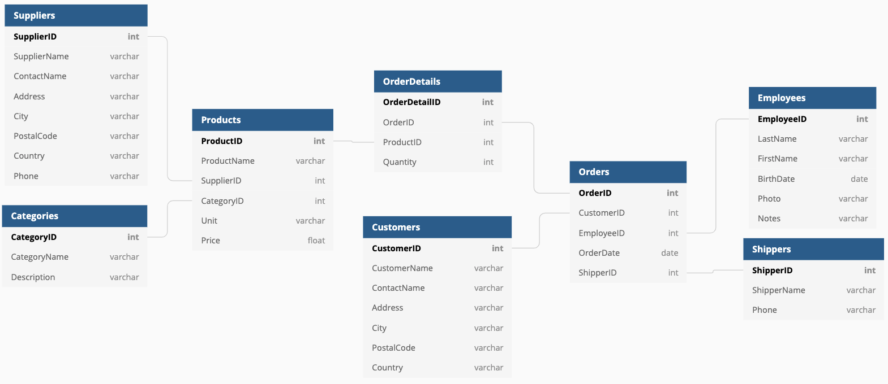

# DB Diagram



## dbdiagram.io

https://dbdiagram.io/home

## コード

```sql
Table Orders {
  OrderID int [pk, increment]
  CustomerID int [ref: > Customers.CustomerID]
  EmployeeID int [ref: > Employees.EmployeeID]
  OrderDate date
  ShipperID int [ref: > Shippers.ShipperID]
}

Table OrderDetails {
  OrderDetailID int [pk, increment]
  OrderID int [ref: > Orders.OrderID]
  ProductID int [ref: > Products.ProductID]
  Quantity int
}

Table Customers {
  CustomerID int [pk, increment]
  CustomerName varchar
  ContactName varchar
  Address varchar
  City varchar
  PostalCode varchar
  Country varchar
}

Table Categories {
  CategoryID int [pk, increment]
  CategoryName varchar
  Description varchar
}

Table Employees {
  EmployeeID int [pk, increment]
  LastName varchar
  FirstName varchar
  BirthDate date
  Photo varchar
  Notes varchar
}

Table Products {
  ProductID int [pk, increment]
  ProductName varchar
  SupplierID int [ref: > Suppliers.SupplierID]
  CategoryID int [ref: > Categories.CategoryID]
  Unit varchar
  Price float
}

Table Shippers {
  ShipperID int [pk, increment]
  ShipperName varchar
  Phone varchar
}

Table Suppliers {
  SupplierID int [pk, increment]
  SupplierName varchar
  ContactName varchar
  Address varchar
  City varchar
  PostalCode varchar
  Country varchar
  Phone varchar
}
```
