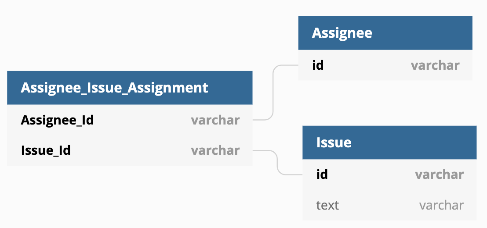

# データベースにおける NULL の扱い

## 課題内容

[airtable](https://airtable.com/tblTnXBXFOYJ0J7lZ/viwyi8muFtWUlhNKG/rec8vi5umvjrlebyz?blocks=hide)

---

## 課題 1

### 結果

```sql
mysql> SELECT NULL = 0, NULL = NULL, NULL <> NULL, NULL AND TRUE, NULL AND FALSE, NULL OR TRUE;
+----------+-------------+--------------+---------------+----------------+--------------+
| NULL = 0 | NULL = NULL | NULL <> NULL | NULL AND TRUE | NULL AND FALSE | NULL OR TRUE |
+----------+-------------+--------------+---------------+----------------+--------------+
|     NULL |        NULL |         NULL |          NULL |              0 |            1 |
+----------+-------------+--------------+---------------+----------------+--------------+
1 row in set (0.00 sec)
```

### 理由

3 つのポイントを抑える必要がある。

1. NULL に関する算術比較は、結果もすべて NULL になる

   - 例えば、=、<、または <> などの算術比較演算子

2. 比較演算子 AND の挙動

   - すべてのオペランドがゼロ以外で非 NULL の場合は 1
   - 1 つ以上のオペランドが 0 の場合は 0 に評価され
   - それ以外は NULL が返される

   ```sql
   mysql> SELECT 1 AND 1, 1 AND 0, 0 AND NULL, NULL AND 0, 1 AND NULL, NULL AND 1, NULL AND NULL;
   +---------+---------+------------+------------+------------+------------+---------------+
   | 1 AND 1 | 1 AND 0 | 0 AND NULL | NULL AND 0 | 1 AND NULL | NULL AND 1 | NULL AND NULL |
   +---------+---------+------------+------------+------------+------------+---------------+
   |       1 |       0 |          0 |          0 |       NULL |       NULL |          NULL |
   +---------+---------+------------+------------+------------+------------+---------------+
   1 row in set (0.01 sec)
   ```

3. 比較演算子 FALSE の挙動

   - 両方のオペランドが非 NULL で、オペランドのいずれかがゼロ以外である場合の結果は 1
   - 両方のオペランドが非 NULL で、オペランドのどちらもゼロの場合の結果は 0
   - NULL オペランドが 1 つあれば、ほかのオペランドがゼロ以外である場合の結果は 1
   - NULL オペランドが 1 つあれば、ほかのオペランドがゼロの場合は NULL
   - 両方のオペランドが NULL であれば、結果は NULL

   ```sql
   mysql> SELECT 1 OR 1, 1 OR 0, 0 OR 0, 1 OR NULL, NULL OR 1, 0 OR NULL, NULL OR 0, NULL OR NULL;
   +--------+--------+--------+-----------+-----------+-----------+-----------+--------------+
   | 1 OR 1 | 1 OR 0 | 0 OR 0 | 0 OR NULL | NULL OR 0 | 1 OR NULL | NULL OR 1 | NULL OR NULL |
   +--------+--------+--------+-----------+-----------+-----------+-----------+--------------+
   |      1 |      1 |      0 |      NULL |      NULL |         1 |         1 |         NULL |
   +--------+--------+--------+-----------+-----------+-----------+-----------+--------------+
   1 row in set (0.00 sec)
   ```

- 参考記事
  - [12.3.3 論理演算子 | MySQL](https://dev.mysql.com/doc/refman/5.6/ja/working-with-null.html)

### メモ

#### 1.

- 疑問
  - DB で TRUE, FALSE は 1,0 で表現される?
- 調査結果
  - boolean 型は、tinyint(1) として扱われる
- 試してみた
  - table 作成
    ```sql
    mysql> create table bool_check(bool boolean);
    Query OK, 0 rows affected (0.10 sec)
    ```
  - カラム確認
    ```sql
    mysql> show columns from bool_check;
    +-------+------------+------+-----+---------+-------+
    | Field | Type       | Null | Key | Default | Extra |
    +-------+------------+------+-----+---------+-------+
    | bool  | tinyint(1) | YES  |     | NULL    |       |
    +-------+------------+------+-----+---------+-------+
    1 row in set (0.02 sec)
    ```
- 参考記事
  - [Mysql の boolean 型について調べてみた](https://qiita.com/ritukiii/items/3a3667391d4d65678d82)

### 2.

- 言語ごとに AND, OR の扱い方異なりそう、、
  - Oracle とは異なっているぽい
  - [6.3 論理条件 | Oracle](https://docs.oracle.com/cd/E23549_01/apirefs.1111/b61613/conditions.htm#i1052219)
- NULL の比較演算子の結果を覚えられそうにないので、NULL を排除した設計にすべきだとおもった
  - 次の課題がまさに NULL 排除の DB 設計だった

## 課題 2

### 解決策

中間テーブルを作成する

### 図



Assign_Issue_Assignment テーブルは、複合主キーかつ外部キーのカラムから成る

<details><summary>作成手法</summary><div>

dbdiagram.io で作成

```
TABLE Assignee {
  id varchar [pk]
}

TABLE Issue {
  id varchar [pk]
  text varchar [NOT NULL]
}

Table Assignee_Issue_Assignment {
  Assignee_Id varchar [pk, ref: > Assignee.id]
  Issue_Id varchar [pk, ref: > Issue.id]
}
```

[dbdiagram.io を使ってコードベースで手軽に ER 図を作成する](https://zenn.dev/ryo_kawamata/articles/introduce-ddbdiagram-io)

</div></details>

### 参考記事

- [中間テーブルとは](https://qiita.com/morikuma709/items/9fde633db9171b36a068)

- [やさしい図解で学ぶ　中間テーブル　多対多　概念編](https://qiita.com/ramuneru/items/db43589551dd0c00fef9)

- [交差テーブルには関連の意味を表す名前をつけよう](https://qiita.com/tkawa/items/dc3e313021f32fd91ca6)

  - Assignee が Issue を Assignment している

- [複合主キーを避けるべき理由](https://torazuka.hatenablog.com/entry/20110713/pk)
  - 後で読む
  - [メモ: 複合主キーを云々いう前に足りなかったこと](https://torazuka.hatenablog.com/entry/20110729/db)

## 課題 3(クイズ)

### クイズ 1

IS NULL, IS NOT NULL はインデックスを利用できるか？

<details><summary>回答</summary><div>

利用できる。
（ただし以前は、インデックスを使わなかったみたい）

- 参考記事

  - [8.2.1.8 IS NULL の最適化 | MySQL Documentation](https://dev.mysql.com/doc/refman/5.6/ja/is-null-optimization.html)
    - > MySQL は、col_name = constant_value に対して使用できる同じ最適化を col_name IS NULL に対しても実行できます。たとえば、MySQL は、インデックスと範囲を使用して、IS NULL を含む NULL を検索できます。
  - [11.2. インデックスの種類 | PostgreSQL 10.5 文書](https://www.postgresql.jp/document/10/html/indexes-types.html)
    - > インデックスの付いた列に対する IS NULL や IS NOT NULL でも B-tree インデックスを使用することができます。
  - [IS NULL はインデックスを使うのか](https://techblog.istyle.co.jp/archives/1514)

    - > NULL はインデックスを使わないって書かれた記事もブログもたくさん見かけます。過去にはそうだったのかも知れません。でも、実装はどんどん変わって行きます。過去に書かれたブログだけを読んでいると、今自分の使っている実装系とは合っていないって事もしばしばあります。やっぱり自分で確かめないとですね！

  - [NULL 撲滅委員会](http://mickindex.sakura.ne.jp/database/db_getout_null.html)
    - > 2. IS NULL、IS NOT NULL を指定する場合、インデックスが参照されないためパフォーマンスが悪い。
    - このブログの筆者の他のシリーズも気になる
      - [リレーショナル・データベースの世界](http://mickindex.sakura.ne.jp/database/idx_database.html)

</div></details>

### クイズ 2

NULL を含む int 型のカラム A に対して、ORDER BY 句を実行した際、NULL の順序はどうなりますか？

<details><summary>回答</summary><div>

MySQL の場合、NULL は最小値として扱われる。
そのため、ORDER BY ASC の場合は先頭に、DESC の場合は末尾に並び替えられてた。

※言語ごとに異なるため、注意

- [NULL と戯れる: ORDER BY と NULL](https://qiita.com/SVC34/items/c23341c79325a0a95979)

```sql
-- table作成
mysql> CREATE TABLE null_order(id int NOT NULL PRIMARY KEY AUTO_INCREMENT, salary int);
Query OK, 0 rows affected (0.23 sec)

-- column確認
mysql> show columns from null_order;
+--------+---------+------+-----+---------+----------------+
| Field  | Type    | Null | Key | Default | Extra          |
+--------+---------+------+-----+---------+----------------+
| id     | int(11) | NO   | PRI | NULL    | auto_increment |
| salary | int(11) | YES  |     | NULL    |                |
+--------+---------+------+-----+---------+----------------+
2 rows in set (0.00 sec)

-- データ追加
mysql> insert into null_order (salary) values (10), (NULL), (100), (90), (NULL), (20), (80), (70), (NULL), (40), (30), (60), (50), (NULL);
Query OK, 14 rows affected (0.04 sec)
Records: 14  Duplicates: 0  Warnings: 0

-- selectで確認
mysql> select * from null_order;
+----+--------+
| id | salary |
+----+--------+
|  1 |     10 |
|  2 |   NULL |
|  3 |    100 |
|  4 |     90 |
|  5 |   NULL |
|  6 |     20 |
|  7 |     80 |
|  8 |     70 |
|  9 |   NULL |
| 10 |     40 |
| 11 |     30 |
| 12 |     60 |
| 13 |     50 |
| 14 |   NULL |
+----+--------+
14 rows in set (0.00 sec)

-- order by 実行結果 (ASC)
mysql> select * from null_order order by salary;
+----+--------+
| id | salary |
+----+--------+
|  2 |   NULL |
|  5 |   NULL |
|  9 |   NULL |
| 14 |   NULL |
|  1 |     10 |
|  6 |     20 |
| 11 |     30 |
| 10 |     40 |
| 13 |     50 |
| 12 |     60 |
|  8 |     70 |
|  7 |     80 |
|  4 |     90 |
|  3 |    100 |
+----+--------+
14 rows in set (0.01 sec)

-- order by 実行結果 (ASC)
mysql> select * from null_order order by salary desc;
+----+--------+
| id | salary |
+----+--------+
|  3 |    100 |
|  4 |     90 |
|  7 |     80 |
|  8 |     70 |
| 12 |     60 |
| 13 |     50 |
| 10 |     40 |
| 11 |     30 |
|  6 |     20 |
|  1 |     10 |
|  2 |   NULL |
|  5 |   NULL |
|  9 |   NULL |
| 14 |   NULL |
+----+--------+
14 rows in set (0.00 sec)

-- PostgreSQL や ORACLE で利用可能な NULLS FIRST を MySQL で実現する方法
mysql> select * from null_order order by salary IS NULL desc, salary desc;
+----+--------+
| id | salary |
+----+--------+
|  2 |   NULL |
|  5 |   NULL |
|  9 |   NULL |
| 14 |   NULL |
|  3 |    100 |
|  4 |     90 |
|  7 |     80 |
|  8 |     70 |
| 12 |     60 |
| 13 |     50 |
| 10 |     40 |
| 11 |     30 |
|  6 |     20 |
|  1 |     10 |
+----+--------+
14 rows in set (0.00 sec)
```

</div></details>
### クイズ 1

IS NULL, IS NOT NULL はインデックスを利用できるか？

<details><summary>回答</summary><div>

利用できる。
（ただし以前は、インデックスを使わなかったみたい）

- 参考記事

  - [8.2.1.8 IS NULL の最適化 | MySQL Documentation](https://dev.mysql.com/doc/refman/5.6/ja/is-null-optimization.html)
    - > MySQL は、col_name = constant_value に対して使用できる同じ最適化を col_name IS NULL に対しても実行できます。たとえば、MySQL は、インデックスと範囲を使用して、IS NULL を含む NULL を検索できます。
  - [11.2. インデックスの種類 | PostgreSQL 10.5 文書](https://www.postgresql.jp/document/10/html/indexes-types.html)
    - > インデックスの付いた列に対する IS NULL や IS NOT NULL でも B-tree インデックスを使用することができます。
  - [IS NULL はインデックスを使うのか](https://techblog.istyle.co.jp/archives/1514)

    - > NULL はインデックスを使わないって書かれた記事もブログもたくさん見かけます。過去にはそうだったのかも知れません。でも、実装はどんどん変わって行きます。過去に書かれたブログだけを読んでいると、今自分の使っている実装系とは合っていないって事もしばしばあります。やっぱり自分で確かめないとですね！

  - [NULL 撲滅委員会](http://mickindex.sakura.ne.jp/database/db_getout_null.html)
    - > 2. IS NULL、IS NOT NULL を指定する場合、インデックスが参照されないためパフォーマンスが悪い。
    - このブログの筆者の他のシリーズも気になる
      - [リレーショナル・データベースの世界](http://mickindex.sakura.ne.jp/database/idx_database.html)

</div></details>
### クイズ 1

IS NULL, IS NOT NULL はインデックスを利用できるか？

<details><summary>回答</summary><div>

利用できる。
（ただし以前は、インデックスを使わなかったみたい）

- 参考記事

  - [8.2.1.8 IS NULL の最適化 | MySQL Documentation](https://dev.mysql.com/doc/refman/5.6/ja/is-null-optimization.html)
    - > MySQL は、col_name = constant_value に対して使用できる同じ最適化を col_name IS NULL に対しても実行できます。たとえば、MySQL は、インデックスと範囲を使用して、IS NULL を含む NULL を検索できます。
  - [11.2. インデックスの種類 | PostgreSQL 10.5 文書](https://www.postgresql.jp/document/10/html/indexes-types.html)
    - > インデックスの付いた列に対する IS NULL や IS NOT NULL でも B-tree インデックスを使用することができます。
  - [IS NULL はインデックスを使うのか](https://techblog.istyle.co.jp/archives/1514)

    - > NULL はインデックスを使わないって書かれた記事もブログもたくさん見かけます。過去にはそうだったのかも知れません。でも、実装はどんどん変わって行きます。過去に書かれたブログだけを読んでいると、今自分の使っている実装系とは合っていないって事もしばしばあります。やっぱり自分で確かめないとですね！

  - [NULL 撲滅委員会](http://mickindex.sakura.ne.jp/database/db_getout_null.html)
    - > 2. IS NULL、IS NOT NULL を指定する場合、インデックスが参照されないためパフォーマンスが悪い。
    - このブログの筆者の他のシリーズも気になる
      - [リレーショナル・データベースの世界](http://mickindex.sakura.ne.jp/database/idx_database.html)

</div></details>

### クイズ 3

NOT IN の条件に NULL が含まれている場合、どのような結果を取得できるでしょうか？

コード例

```sql
select * from order_null where salary not in (100, 50, null);
```

<details><summary>回答</summary><div>

常に空の結果セットが返る。

```sql
mysql> select * from null_order where salary not in (100, 50, null);
Empty set (0.00 sec)
```

理由としては、Salary <> NULL は常に FALSE となるため。

</div></details>
