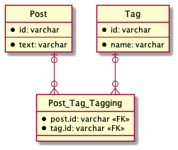

# データベース設計のアンチパターンを学ぶ 1

## 課題内容

[airtable](https://airtable.com/tblTnXBXFOYJ0J7lZ/viwyi8muFtWUlhNKG/recIckfWrNSCSWwvi?blocks=hide)

---

## 課題 1

### 1

このような設計を Jaywalking という。

```sql
TABLE Post {
  id: varchar
  text: varchar
  tags: varchar   -- ("tagA,tagB,tagC"といった値が入る)
}
```

Post Table の例

| id  | text             | tags                     |
| --- | ---------------- | ------------------------ |
| 1   | I have a pen.    | stationery               |
| 2   | I have an apple. | fruits, red              |
| 3   | apple pen        | stationery, fruits, joke |
| 4   | coke             | drink, black             |
| 5   | happy            | emotion                  |

#### Jaywalking の問題点

- 効率的な検索ができなくなる

  - もし、tags に fruits が含まれるレコードを取得したい場合、正規表現やパターンマッチする必要がある

    インデックスが効かなくなる

  - もし、`id=3` の tags を知りたい場合、アプリケーション側で分割する必要がある

    `stationery, fruits, joke` -> `stationery`, `fruits`, `joke`

- UPDATE/INSERT/DELETE めんどくさすぎる

  - もし、`id=3` の tags から `stationery`, `fruits` を削除したい場合、やることが多すぎる

    1. 取得(select): `stationery, fruits, joke`
    2. アプリケーション側で分割(split): `stationery`, `fruits`, `joke`
    3. 削除(remove): `stationery`, `fruits`, `joke` -> `joke`
    4. 更新(update): `joke`

- tags カラムで桁溢れが起きるかも

- 仕様変更/表現できない状態 は思い浮かばなかったです、、

#### 参考記事

- [SQL アンチパターン - ジェイウォーク](https://www.slideshare.net/kamekoopa/ss-26685543)

### 2



[ER 図](https://plantuml.com/ja/ie-diagram)
