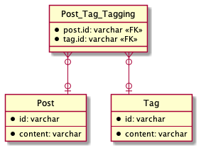
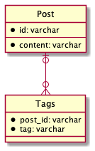

# データベース設計のアンチパターンを学ぶ 2

## 課題内容

[airtable](https://airtable.com/tblTnXBXFOYJ0J7lZ/viwyi8muFtWUlhNKG/recWrGdlH7hDp6NoC?blocks=hide)

---

## 課題 1

### 1

このような設計を Multicolumn Attriubtes という。

```sql
TABLE Post {
  id: varchar
  content: varchar
  tag1: varchar
  tag2: varchar
  tag3: varchar
}

TABLE Tag {
  id: varchar
  content: varchar
}
```

**Post Table の例**

| id  | text             | tag1 | tag2 | tag3 |
| --- | ---------------- | ---- | ---- | ---- |
| 1   | I have a pen.    | 1    | NULL | NULL |
| 2   | I have an apple. | 2    | 3    | NULL |
| 3   | apple pen        | 1    | 2    | 4    |
| 4   | coke             | 5    | 6    | NULL |
| 5   | happy            | 7    | NULL | NULL |

<br>

**Tag Table の例**

| id  | text       |
| --- | ---------- |
| 1   | stationery |
| 2   | fruits     |
| 3   | red        |
| 4   | joke       |
| 5   | drink      |
| 6   | black      |
| 7   | emotion    |

#### Multicolumn Attriubtes の問題点

- 効率的な検索ができなくなる

  - あるタグのついた投稿を検索する場合、全てのカラムに対して OR 検索をしなければならない

    ```sql
    select * from post
    where tag1 = 1
       or tag2 = 1
       or tag3 = 1;
    ```

    - 一応、IN 句でも書けるみたい（けど、冗長）

      ```sql
      select * from post
      where 1 in (tag1, tag2, tag3);
      ```

  - 複数のタグがついた投稿を検索する場合、さらにめんどくさい

    ```sql
    select * from post
    where (tag1 = 1 or tag2 = 1 or tag3 = 1)
      and (tag1 = 2 or tag2 = 2 or tag3 = 2);
    ```

  - もし、`id=3` の tags を知りたい場合、アプリケーション側で分割する必要がある

    `stationery, fruits, joke` -> `stationery`, `fruits`, `joke`

- 追加 が一筋縄ではできない

  - Post.id=1 にタグを追加する場合、どのカラムが NULL か確認する必要がある。

    ```sql
    mysql> select * from post where id = 1;

    | id  | text             | tag1 | tag2 | tag3 |
    | --- | ---------------- | ---- | ---- | ---- |
    | 1   | I have a pen.    | 1    | NULL | NULL |
    ```

    ```sql
    mysql> update post set tag2 = 4 where id = 1;
    ```

  - NULL が入っている最初のカラムにタグを追加する、の場合クエリが複雑ならできるけど、、

    ```sql
    update post
    set tag1 = case
          when 7 in (tag2, tag3) then tag1
          else coalesce(tag1, 7) end,
        tag2 = case
          when 7 in (tag1, tag3) then tag2
          else coalesce(tag2, 7) end,
        tag3 = case
          when 7 in (tag1, tag2) then tag3
          else coalesce(tag3, 7) end,
    where id = 1;
    ```

    こういう複雑なクエリを書かなければならないときは、テーブル設計を直した方が良いな

- 削除 が一筋縄ではできない

  - tag.id=7 のタグを削除する場合、クエリめんどくさい

    ```sql
    update post
    set tag1 = nullif(tag1, 7),
        tag2 = nullif(tag2, 7),
        tag3 = nullif(tag3, 7),
    ```

- 同じタグが登録されてしまう可能性がある

  - DB の制約では、防ぎ用がない気がする

- 3 つまでしか Tag を設定することができない

  - もし、4 つ以上 Tag を設定したい場合、新たにカラムを追加する必要がある

    ```sql
    alter table post add column tag4 varchar(20);
    ```

    そして、`ALTER TABLE` 文は遅い。

    > 1. alter table の内容を元に新テーブル定義されたテンポラリテーブルを作成
    > 2. 既存テーブルからテンポラリテーブルにデータを登録
    > 3. 旧テーブルを削除
    > 4. テンポラリテーブルの名前を旧テーブル名に rename

    [mysql 5.6~での alter table でやらかさない](https://qiita.com/katamotokosuke/items/481dbedfb77842f8e395#高速index作成とは:~:text=%E3%81%9D%E3%82%82%E3%81%9D%E3%82%82alter%20table%E3%81%AF%E7%B5%90%E6%A7%8B%E5%BF%99%E3%81%97%E3%81%84%E5%87%A6%E7%90%86%E3%81%A7%E3%81%99)

- NULL は諸悪の原因

#### 参考記事

- [7 章 マルチカラムアトリビュート（複数列属性）](https://qiita.com/mizunokura/items/a9be12e0eddcf5d90f07)

### 2

#### 交差テーブル



#### 従属テーブル



#### 交差テーブルと従属テーブルのどちらを採用する?

交差テーブルの方が汎用性が高そう。
Tag が Post テーブル以外に紐づかないのであれば、従属テーブルでも良いかなと思った。

（正規化の話になるのかな？
