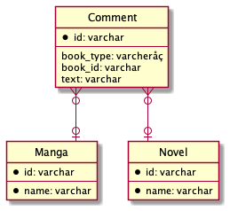
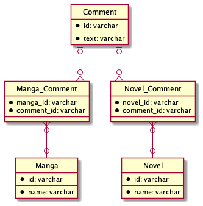
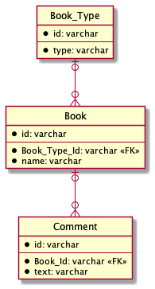
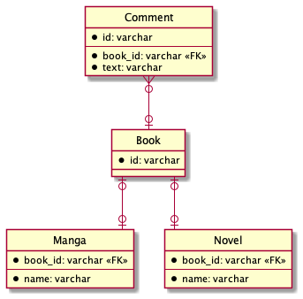

# データベース設計のアンチパターンを学ぶ 3

## 課題内容

[airtable](https://airtable.com/tblTnXBXFOYJ0J7lZ/viwyi8muFtWUlhNKG/recxnZs44LV1zfR5D?blocks=hide)

---

## 課題 1

### 1

#### そもそも

`belongs_to_id` カラムに格納されている ID 値が衝突する可能性がある。
そのため、どちらのテーブル ID か判別不可になってしまう。

Manga

| id  | name       |
| --- | ---------- |
| 1   | ワンピース |

Novel

| id  | name       |
| --- | ---------- |
| 1   | 推し、燃ゆ |

Comment

| id  | text       | belongs_to_id |
| --- | ---------- | ------------- |
| 1   | 面白いです | 1             |

#### Manga, Novel の ID カラムの値を衝突しないようにすると

Manga

| id  | name       |
| --- | ---------- |
| 1   | ワンピース |
| 2   | ハイキュー |

Novel

| id  | name       |
| --- | ---------- |
| 3   | 推し、燃ゆ |

Comment

| id  | text       | belongs_to_id |
| --- | ---------- | ------------- |
| 1   | 面白いです | 1             |

実現できそうに見えるが、問題もある。

- Manga テーブルと Novel テーブルの ID カラムが衝突しないように管理しなければいけない
- Comment テーブルの `belongs_to_id` カラムに外部キー参照を設定できない
  - 外部キー参照は 1 つのテーブルのみ可能

#### ポリモーフィック関連 (アンチパターン)

Manga

| id  | name       |
| --- | ---------- |
| 1   | ワンピース |
| 2   | ハイキュー |

Novel

| id  | name                 |
| --- | -------------------- |
| 1   | 推し、燃ゆ           |
| 2   | 赤毛のアン・シリーズ |

Comment

| id  | book_type | book_id | text       |
| --- | --------- | ------- | ---------- |
| 1   | Manga     | 2       | 面白いです |
| 2   | Novel     | 2       | 名著です   |

 

- Comment テーブルの `book_id` カラムに外部キー参照を設定できない
  - 外部キー参照は 1 つのテーブルのみ可能
- book_type の値とテーブル名が一致するかも保証できない

#### 参考記事

- [「SQL アンチパターン」を避けるためのチェックリスト ①（DB 論理設計編）](https://www.ketancho.net/entry/2018/03/07/080000)
- [SQL アンチパターン勉強会　第 6 回：ポリモーフィック関連](https://qiita.com/dai329/items/1db8fbe37f43a465d801)
- [SQL アンチパターンを読んで （ポリモーフィック関連について）](https://blog.motimotilab.com/?p=207)

### 2

#### 交差テーブル

#### 共通テーブルとして Book テーブルを作る

#### ID のみを管理する Book テーブルを作成する

#### どれを選択するか？

個人的には、ストリクトかつ理解しやすい交差テーブル案が、よい。

#### 参考記事

- [SQL アンチパターン勉強会　第 6 回：ポリモーフィック関連](https://qiita.com/dai329/items/1db8fbe37f43a465d801)
