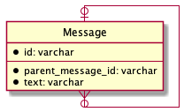
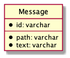
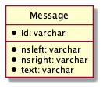
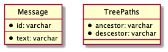

# データベース設計のアンチパターンを学ぶ 4

## 課題内容

[airtable](https://airtable.com/tblTnXBXFOYJ0J7lZ/viwyi8muFtWUlhNKG/recDipfdzwzNwkmsn?blocks=hide)

---

## 課題 1

本課題は、SQL アンチパターンのナイーブツリーに該当する。
そのため、書籍を参照しながら回答します。

### 隣接リスト

このような設計は、隣接リストと呼ばれる。

```sql
TABLE Message {
  id: varchar
  parent_message_id: varchar
  text: varchar
  FOREIGN KEY (parent_message_id) REFERENCES Message(id)
}
```



#### 良い点

1. 直近の子の取得クエリが簡易

   ```sql
   -- id=1 の直近の子を取得する
   SELECT
     m1.*,
     m2.*
   FROM
     Message m1
     LEFT OUTER JOIN Message m2 ON m1.id = m2.parent_message_id
   WHERE
     m1.id = 1;;
   ```

2. 葉ノードの修正クエリが簡易

   ```sql
   -- message.id=7 にメッセージを追加する
   INSERT INTO
     Message (parent_message_id, text)
   VALUES
     (7, 'ありがとう');
   ```

3. ノードやサブツリーの移動クエリが簡易

   ```sql
   UPDATE
     Message
   SET
     parent_message_id = 3
   where
     id = 6;
   ```

#### 問題点

1. 先祖や子孫を取得する場合、取得したい階層分 JOIN しなければならない。また、JOIN の数は固定しなければならない。

   ```sql
   -- 4つ目の階層までコメントを取得したい場合
   SELECT
     m1.*,
     m2.*,
     m3.*,
     m4.*
   FROM
     Message m1
     LEFT OUTER JOIN Message m2 ON m2.parent_message_id = m1.id
     LEFT OUTER JOIN Message m3 ON m3.parent_message_id = m2.id
     LEFT OUTER JOIN Message m4 ON m4.parent_message_id = m3.id;
   ```

2. サブツリー全体を削除するために複数クエリが必要

   ```sql
   -- Message.id = 4 を削除したい場合（サブツリー全体を削除）
   -- すべての子孫を特定する
   SELECT id FROM Message WHERE parent_message_id = 4; -- 5,6 を返す
   SELECT id FROM Message WHERE parent_message_id = 5; -- 何も返さない
   SELECT id FROM Message WHERE parent_message_id = 6; -- 7 を返す
   SELECT id FROM Message WHERE parent_message_id = 7; -- 8 を返す
   SELECT id FROM Message WHERE parent_message_id = 8; -- 何も返さない

   -- 最下層から順に削除
   DELETE FROM Message WHERE id IN (8);
   DELETE FROM Message WHERE id IN (7);
   DELETE FROM Message WHERE id IN (5,6);
   DELETE FROM Message WHERE id IN (4);
   ```

3. 非葉ノードを削除する際に、対象のノードの削除前にの parent_message_id を更新する必要がある。（つまり、複数クエリが必要）

   ```sql
   -- 削除対象のノードのparent_message_idを取得する
   SELECT parent_message_id FROM Message WHERE id = 6; -- 4 を返す
   -- 削除対象のノードの子のparent_message_idを更新する
   UPDATE Message SET parent_message_id = 4 WHERE parent_message_id = 6;
   -- 削除対象のノードの削除
   DELETE FROM Message WHERE id = 6;
   ```

## 課題 2

隣接リストモデルの代替となるモデルは主に 3 種類存在する。

### 経路列挙モデル (Path Enumeration)



| id  | path     | text                                             |
| --- | -------- | ------------------------------------------------ |
| 1   | 1/       | このバグの原因は何かな？                         |
| 2   | 1/2/     | ヌルポじゃないかな？                             |
| 3   | 1/2/3/   | そうじゃないよ、それは確認済みだ。               |
| 4   | 1/4/     | 無効な入力を調べてみたら？                       |
| 5   | 1/4/5/   | そうか、バグの原因はそれだな。                   |
| 6   | 1/4/6/   | よし、じゃあチェック機能を追加してもられるかな？ |
| 7   | 1/4/6/7/ | 了解、修正したよ。                               |

### 入れ子集合モデル (Nested Set)



| id  | nsleft | nsright | text                                             |
| --- | ------ | ------- | ------------------------------------------------ |
| 1   | 1      | 14      | このバグの原因は何かな？                         |
| 2   | 2      | 5       | ヌルポじゃないかな？                             |
| 3   | 3      | 4       | そうじゃないよ、それは確認済みだ。               |
| 4   | 6      | 13      | 無効な入力を調べてみたら？                       |
| 5   | 7      | 8       | そうか、バグの原因はそれだな。                   |
| 6   | 9      | 12      | よし、じゃあチェック機能を追加してもられるかな？ |
| 7   | 10     | 11      | 了解、修正したよ。                               |

### 閉包テーブルモデル (Closure Table)



| id  | text                                             |
| --- | ------------------------------------------------ |
| 1   | このバグの原因は何かな？                         |
| 2   | ヌルポじゃないかな？                             |
| 3   | そうじゃないよ、それは確認済みだ。               |
| 4   | 無効な入力を調べてみたら？                       |
| 5   | そうか、バグの原因はそれだな。                   |
| 6   | よし、じゃあチェック機能を追加してもられるかな？ |
| 7   | 了解、修正したよ。                               |

| ancestor | descendant |
| -------- | ---------- |
| 1        | 1          |
| 1        | 2          |
| 1        | 3          |
| 1        | 4          |
| 1        | 5          |
| 1        | 6          |
| 1        | 7          |
| 2        | 2          |
| 2        | 3          |
| 3        | 3          |
| 4        | 4          |
| 4        | 5          |
| 4        | 6          |
| 4        | 7          |
| 5        | 5          |
| 6        | 6          |
| 6        | 7          |
| 7        | 7          |

### どれを選択するか？

閉包テーブル (closure-table) を選択する

| 設計         | テーブル数 | 子へのクエリ実行 | ツリーへのクエリ実行 | 挿入   | 削除   | 参照整合性維持 |
| ------------ | ---------- | ---------------- | -------------------- | ------ | ------ | -------------- |
| 隣接リスト   | 1          | 簡単             | 難しい               | 簡単   | 簡単   | 可能           |
| 経路列挙     | 1          | 簡単             | 簡単                 | 簡単   | 簡単   | 不可能         |
| 入れ子集合   | 1          | 難しい           | 難しい               | 難しい | 難しい | 不可能         |
| 閉包テーブル | 2          | 簡単             | 簡単                 | 簡単   | 簡単   | 可能           |

## 参考文献

[SQL アンチパターンのナイーブツリー章を実際に手を動かしてみた](https://github.com/kooooichi24/sql-anti-pattern-exercise/tree/master/src/Trees)
