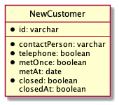
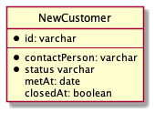
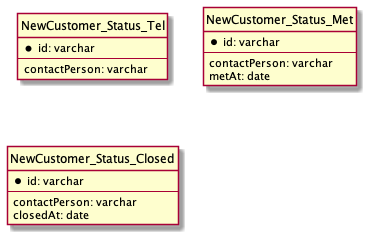
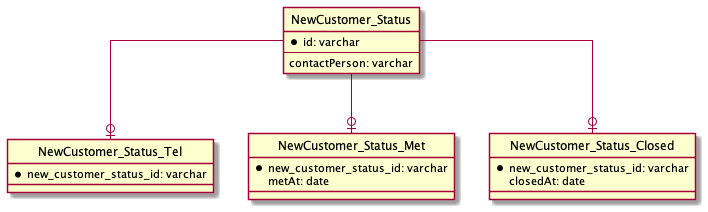

# データベース設計のアンチパターンを学ぶ 5

## 課題内容

[airtable](https://airtable.com/tblTnXBXFOYJ0J7lZ/viwyi8muFtWUlhNKG/recs0SLG3aI2wTeWi?blocks=hide)

---

## 課題 1

本課題は、SQL アンチパターンの EAV に該当する。
そのため、書籍を参照しながら回答します

### テーブル設計

```sql
TABLE NewCustomer {
  id: varchar PK FK
  contactPerson: varchar FK -- 担当者
  telephone: boolean -- 電話をかけたらTRUEになる
  metOnce: boolean -- アポで面談したらTRUEになる
  metAt: date -- 面談をした日付が入る
  closed: boolean -- 成約した
  closedAt: boolean -- 成約した日付が入る
}
```



| id  | telephone | metOnce | metAt     | closed | closedAt  |
| --- | --------- | ------- | --------- | ------ | --------- |
| 1   | false     | false   | NULL      | false  | NULL      |
| 2   | true      | false   | NULL      | false  | NULL      |
| 3   | true      | true    | 2021/5/10 | false  | NULL      |
| 4   | true      | true    | 2021/5/10 | true   | 2021/5/31 |

#### 問題点

1. 顧客のステータスを確認したい場合、アプリケーション側で判断しなければいけない。

   各カラムのフラグ値を確認する必要がある。

2. NULL が大発生してしまう

   マルチカラムアトリビュートと同様の問題点

3. どの属性がどのサブタイプに所属するかを定義するメタデータがない

   例) metAt は metOnce と、closedAt は closed と対応関係がある。

   そのため、開発者側が対応関係を管理しなければならない。（本来は、DB で管理するもの）
   また、誤って metAt の値を closedAt に追加するなどのエラーが発生する恐れがあり、DB 側で防ぐことができない。

## 課題 2

### 1. シングルテーブル継承

```sql
TABLE NewCustomer {
  id: varchar PK FK
  contactPerson: varchar FK -- 担当者
  status varchar -- ('tel', 'met', 'closed') が入る
  metAt: date -- 面談をした日付が入る
  closedAt: date -- 成約した日付が入る
}
```



#### 改善成果

1. 顧客のステータス(どこまで完了しているか)を確認したい場合、アプリケーション側で判断しなければいけない。

   -> ◯ status カラムを取得すれば、ステータスを確認可能

2. NULL が大発生してしまう

   -> × metAt, closedAt カラムが、NULL の可能性ある

3. どの属性がどのサブタイプに所属するかを定義するメタデータがない

   -> × 同じ問題がある

### 2. 具象テーブル継承

```sql
TABLE NewCustomer_Status_Tel {
  id: varchar PK FK
  contactPerson: varchar FK -- 担当者
}

TABLE NewCustomer_Status_Met {
  id: varchar PK FK
  contactPerson: varchar FK -- 担当者
  metAt: date -- 面談をした日付が入る
}

TABLE NewCustomer_Status_Closed {
  id: varchar PK FK
  contactPerson: varchar FK -- 担当者
  closedAt: date -- 成約した日付が入る
}
```



#### 改善成果

1. 顧客のステータス(どこまで完了しているか)を確認したい場合、アプリケーション側で判断しなければいけない。

   -> × NewCustomer_Status_Tel, NewCustomer_Status_Met, NewCustomer_Status_Closed テーブルを JOIN しないとわからない。かつ、アプリケーション側で判断する必要がある

2. NULL が大発生してしまう

   -> ◯ サブタイプ毎にテーブルを作成するため、NULL にならない

3. どの属性がどのサブタイプに所属するかを定義するメタデータがない

   -> ◯ サブタイプ毎にテーブルを作成するため、一致している。そのため、誤って metAt の値を closedAt に追加するなどのエラーを防ぐことができる。

#### 問題点

4. すべてのサブタイプに共通する属性と、サブタイプ固有の造成の区別が容易ではない

### クラステーブル継承

```sql
TABLE NewCustomer_Status {
  id: varchar PK FK
  contactPerson: varchar FK -- 担当者
}

TABLE NewCustomer_Status_Tel {
  new_customer_status_id: varchar PK FK
}

TABLE NewCustomer_Status_Met {
  new_customer_status_id: varchar PK FK
  metAt: date -- 面談をした日付が入る
}

TABLE NewCustomer_Status_Closed {
  new_customer_status_id: varchar PK FK
  closedAt: date -- 成約した日付が入る
}
```



#### 改善成果

1. 顧客のステータス(どこまで完了しているか)を確認したい場合、アプリケーション側で判断しなければいけない。

   -> × 同様に、NewCustomer_Status_Tel, NewCustomer_Status_Met, NewCustomer_Status_Closed テーブルを JOIN しないとわからない。かつ、アプリケーション側で判断する必要がある

2. NULL が大発生してしまう

   -> ◯ サブタイプ毎にテーブルを作成するため、NULL にならない

3. どの属性がどのサブタイプに所属するかを定義するメタデータがない

   -> ◯ サブタイプ毎にテーブルを作成するため、一致している。そのため、誤って metAt の値を closedAt に追加するなどのエラーを防ぐことができる。

4. すべてのサブタイプに共通する属性と、サブタイプ固有の造成の区別が容易ではない

   -> ◯ サブタイプに共通する属性を基底テーブルに移譲することで、区別可能になった

### どれを選択するか？

- NULL 許容できるなら、シングルテーブル継承
- NULL 許容できないのなら、具象テーブル継承 か クラステーブル継承
  - あまり JOIN したくない場合は、具象テーブル継承
  - JOIN しても良い場合は、クラステーブル継承

### メモ

- 疑問 1
  - Salesforce 以外の他の具体例で見てみたいな
- 回答 1
  - [Player, Footballer, Cricketer, Bower の例を発見](https://martinfowler.com/eaaCatalog/singleTableInheritance.html)

### 参考記事

- [3 つの継承 OR マッピングパターン](https://qiita.com/yebihara/items/9ecb838893ad99be0561#3%E3%81%A4%E3%81%AE%E7%B6%99%E6%89%BFor%E3%83%9E%E3%83%83%E3%83%94%E3%83%B3%E3%82%B0%E3%83%91%E3%82%BF%E3%83%BC%E3%83%B3)

- [Catalog of Patterns of Enterprise Application Architecture](https://martinfowler.com/eaaCatalog/index.html)
