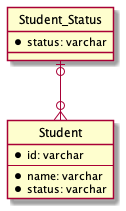

# データベース設計のアンチパターンを学ぶ 6

## 課題内容

[airtable](https://airtable.com/tblTnXBXFOYJ0J7lZ/viwyi8muFtWUlhNKG/recJclAcSDreEzHsY?blocks=hide)

---

## 課題 1

本課題は、SQL アンチパターンの サーティーワンフレーバー に該当する。
そのため、書籍を参照しながら回答します。

### アンチパターン: 限定する値を列定義で指定する

1. CHECK 制約を用いる場合

   ```sql
   TABLE Student {
     id: varchar
     name: varchar
     status: varchar CHECK(status IN ("studying", "graduated", "suspended")) -- ここ
   }
   ```

2. ENUM 型を用いる場合

   ```sql
   TABLE Student {
     id: varchar
     name: varchar
     status: varchar ENUM("studying", "graduated", "suspended") -- ここ
   }
   ```

#### 問題点

以下は、CHECK 制約と ENUM 型のどちらにも共通する問題点である。

1. status 列で許可されている列挙値を取得するために、システムビューを検索しなければならない

   ```sql
   SELECT
     column_type
   FROM
     information_schema.columns
   WHERE
     table_schema = 'database_name'
     AND table_name = 'student'
     AND column_name = 'status';
   ```

   上記のクエリは、文字列`ENUM('studying', 'graduated', 'suspended’)`が格納された LONGTEXT 型の列が取得できる。
   もし、status 値を画面上の選択部分に表示するためには、この文字列を解析し、一重引用符内の値を抽出するアプリケーションコードを書かなければならない。

   （大変だ、、

2. 新しい列挙値を追加するには、新たな列挙値で列を再定義しなければならない

   例えば、休学中という status を新たに追加する場合、以下のクエリを実行する必要がある

   ```sql
   ALTER TABLE
     Student
   MODIFY
     COLUMN
   status
     ENUM('studying', 'graduated', 'suspended', 'leaving');
   ```

   上記のクエリは 3 つの問題点が存在する。

   1. 追加前の列定義の値が`'studying', 'graduated', 'suspended'`であることを知っている必要がある。つまり、問題点 1 と同様の問題が発生する。
   2. DB 製品によっては、テーブルが空でないと列定義を変更できない場合がある。そのため、テーブルへのアクセスブロック、テーブルの内容をダンプ、テーブル再定義、保存したデータの読み込みを実施しなければならない場合がある。
   3. どちらにしても、ALTER TABLE コマンドはコストが大きい

3. 列挙値を削除する場合、削除する値のレコードに対して対応する必要がある

   例えば、suspended を削除する場合、以下のクエリを実行する

   ```sql
   ALTER TABLE
     Student
   MODIFY
     COLUMN
   status
     ENUM('studying', 'graduated');
   ```

   上記のクエリを実行した場合、2 つの扱いについて対応する必要がある

   1. status が suspended になっている既存のレコードを**変更する**場合、デフォルト値や NULL に設定しなければならない。
   2. status が suspended になっている既存のレコードを**変更してはいけない**場合、suspended をユーザー側に表示しないようにする必要がある。

4. 移植が大変

   CHECK 制約や ENUM 型は DB 毎に仕様が統一されていないから大変（らしい）

## 課題 2

### 参照テーブルを作成する

```sql
CREATE TABLE Student_Status (
  status varchar(20) PRIMARY KEY
);

CREATE TABLE Student (
  id varchar PRIMARY KEY
  name varchar
  status varchar
  FOREIGN KEY (status) REFERENCES Studend_Status(status)
    ON UPDATE CASCADE
);
```

Student_Status

| status    |
| --------- |
| studying  |
| graduated |
| suspended |

Student

| id  | name | status    |
| --- | ---- | --------- |
| 1   | A    | studying  |
| 2   | B    | graduated |
| 3   | C    | suspended |
| 4   | D    | studying  |



#### 改善箇所

1. status 列で許可されている列挙値を取得するために、システムビューを検索しなければならない

   -> 参照テーブルを検索すれば簡単に取得可能

   ```sql
   SELECT * FROM Student_Status;
   ```

2. 新しい列挙値を追加するには、新たな列挙値で列を再定義しなければならない

   -> 参照テーブルに追加するだけでよい（ALTER 文やアクセスブロックをしなくてよい

   ```sql
   INSERT INTO Student_Status (status) VALUES ('leaving');
   ```

3. 列挙値を削除する場合、削除する値のレコードに対して対応する必要がある

   -> 参照されているため、参照テーブルのレコードは削除できない。その代わり、参照テーブルに新たに属性列を追加することで廃止したい値が区別可能になる。

   ```sql
   -- 活性/非活性を判断する属性列の追加
   ALTER TABLE Student_Status ADD COLUMN active
   ENUM('INACTIVE', 'ACTIVE') NOT NULL DEFAULT 'ACTIVE';

   -- 値の廃止
   UPDATE Student_Status SET active = 'INACTIVE' WHERE status = 'suspended';

   -- UIに表示する値を取得する場合は、active='ACTIVE'のステータス値のみを取得
   SELECT status FROM Student_Status WHERE active = 'ACTIVE';
   ```

4. 移植が大変

   -> 標準的な SQL 機能で実現しているため、移植が容易！
