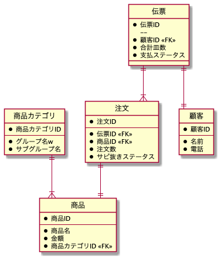
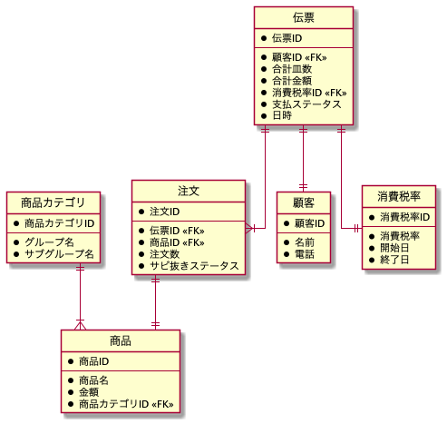
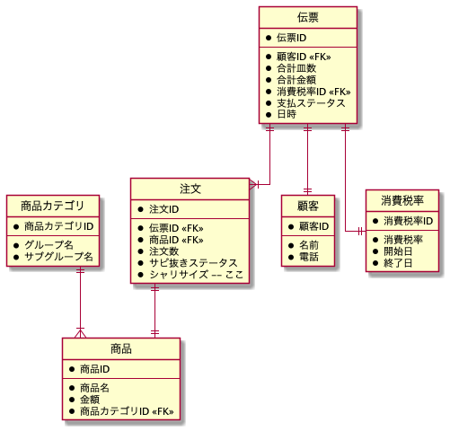
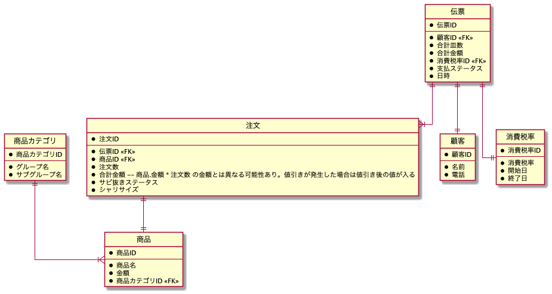

# DB モデリング 1

## 課題内容

[airtable](https://airtable.com/tblTnXBXFOYJ0J7lZ/viwyi8muFtWUlhNKG/recWPAwB0NWLdQTxO?blocks=hide)

---

## 課題 1

本課題では、テーブル名およびカラム名を日本語で命名しました。
### 作業ステップ

1. イベントを見つける

   イベントは「注文」。なぜなら、「〜する」という表現が可能だから。

   ```sql
   -- イベント系
   TABLE 注文 {
   }
   ```

2. リソースを見つける

   リソースは「顧客」「商品」「商品カテゴリ」「伝票情報」。なぜなら、「〜する」という表現が成立しないから。

   ※リソース項目: 「誰に」「誰が」「何を」「どこ」

   ```sql
   -- イベント系
   TABLE 注文 {
   }

   -- リソース系
   TABLE 顧客 {
   }
   TABLE 商品 {
   }
   TABLE 商品カテゴリ {
   }
   TABLE 伝票情報 {
   }
   ```

   「見たままをデータモデルにすること」を重視して、イベント・リソース系の列挙はここまでとする。

3. スキーマの項目を埋める

   ```sql
    -- イベント系
    TABLE 注文 {
      注文数
      サビ抜きステータス
    }


    -- リソース系
    TABLE 顧客 {
      名前
      電話
    }
    TABLE 商品 {
      商品名
      金額
    }
    TABLE 商品カテゴリ {
      グループ名
      サブグループ名
    }
    TABLE 伝票情報 {
      合計皿数
      支払ステータス
    }
   ```

4. ID の導入

   ```sql
    -- イベント系
    TABLE 注文 {
      ID
      注文数
      サビ抜きステータス
    }

    -- リソース系
    TABLE 顧客 {
      ID
      名前
      電話
    }
    TABLE 商品 {
      ID
      商品名
      金額
    }
    TABLE 商品カテゴリ {
      ID
      グループ名
      サブグループ名
    }
    TABLE 伝票情報 {
      ID
      合計皿数
      支払ステータス
    }
   ```

5. リレーションの設定

   

6. DB スキーマのリファクタリング

   - 合計金額・消費税・注文日時を追加
   - サビ抜きと支払いステータスは現状 0/1 想定のため、正規化しない

   

## 課題 2

### 変更点 1 対応

注文テーブルにシャリサイズを追加



### 変更点 2 対応

#### 現状、寿司ネタが毎月何個売れているためには

（そんなに悪いと思わないけどな、、、JOIN が 2 つあるのが気になるくらい。

```sql
SELECT 商品.商品名 FROM 注文
INNER JOIN 商品 ON 商品.商品ID = 注文.商品ID
INNER JOIN 伝票 ON 伝票.伝票ID = 注文.伝票ID
GROUP BY DATE_FORMAT(伝票.日時, '%Y%m'), 商品.商品名
ORDER BY 商品.商品名 DESC;
```

修正パスします、、

## 課題 3

- 追加仕様
  - 一皿 220 円(税別)以上のお好みすしのうち、同じネタを 2 つおきの購入で 40 円割引とするキャンペーンを始めたい。
- 例
  - えび 2 個
    - 180 \* 2 - 40
  - えび 3 個
    - 180 \* 3 - 40
  - えび 1 個 + 生サーモン 1 個
    - 180 + 220
  - えび 2 個 + 生サーモン 2 個
    - 180 \* 2 - 40 + 220 \* 2 - 40

<details><summary>回答例</summary>

元々、注文テーブルは合計金額を持っていなかった。
なぜなら、商品金額と個数から合計金額を導出することができるため、冗長性を排除していた。
しかしながら今回の場合、`商品金額*個数 != 合計金額` であり、導出不可能である。つまり合計金額の意味が異なるため、冗長性の排除が不可能である。
そのため、注文テーブルに合計金額を新たに追加した。

```wsd
@startuml 3-references-table

' hide the spot
hide circle
' avoid problems with angled crows feet
skinparam linetype ortho

entity 注文 {
  *注文ID
  --
  *伝票ID <<FK>>
  *商品ID <<FK>>
  *注文数
  *合計金額 -- 商品.金額 * 注文数 の金額とは異なる可能性あり。値引きが発生した場合は値引き後の値が入る
  *サビ抜きステータス
  *シャリサイズ
}

entity 顧客 {
  *顧客ID
  --
  *名前
  *電話
}

entity 商品 {
  *商品ID
  --
  *商品名
  *金額
  *商品カテゴリID <<FK>>
}

entity 商品カテゴリ {
  *商品カテゴリID
  --
  *グループ名
  *サブグループ名
}

entity 伝票 {
  *伝票ID
  --
  *顧客ID <<FK>>
  *合計皿数
  *合計金額
  *消費税率ID <<FK>>
  *支払ステータス
  *日時
}

entity 消費税率 {
  *消費税率ID
  --
  *消費税率
  *開始日
  *終了日
}

商品カテゴリ ||--|{ 商品
注文 ||--|| 商品
伝票 ||--|| 顧客
伝票 ||--|{ 注文
伝票 ||--|| 消費税率

@enduml
```



</details>
