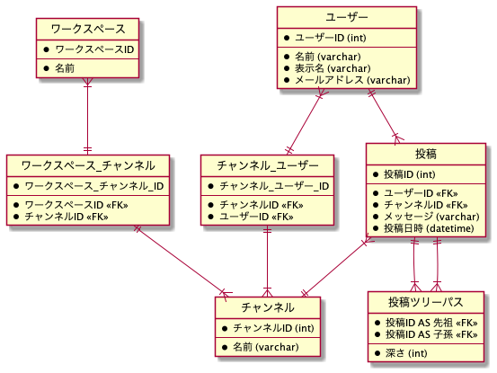
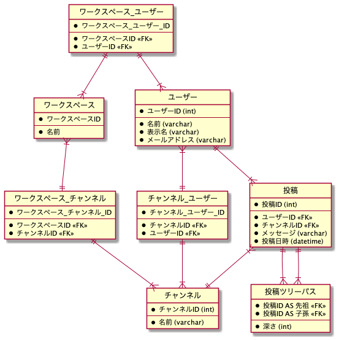
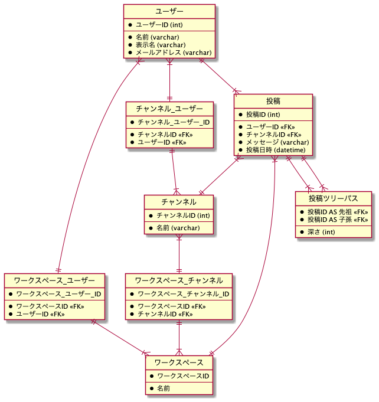
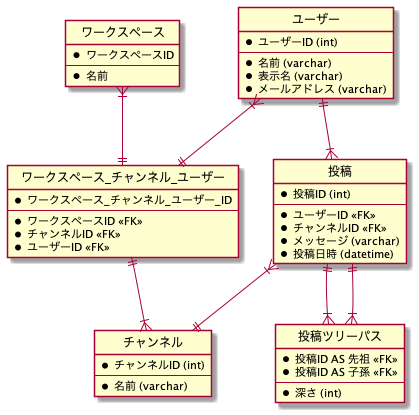
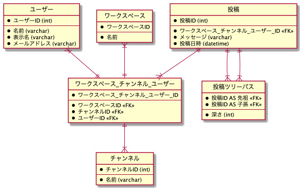

# DB モデリング 2

## 課題内容

[airtable](https://airtable.com/tblTnXBXFOYJ0J7lZ/viwyi8muFtWUlhNKG/recCDmAj926oLfOde?blocks=hide)

---

## 課題 1

本課題では、テーブル名およびカラム名を日本語で命名しました。

### 作業ステップ

1. イベントを見出す

   ```wsd
   entity 投稿 {
   }
   ```

2. リソース系を抜き出す

   ```wsd
   entity 投稿 {
   }


   entity ユーザー {
   }

   entiry チャンネル {
   }

   entity ワークスペース {
   }
   ```

3. 項目を入れていく

   ```wsd
   entity 投稿 {
     *投稿ID
     --
     *メッセージ
     *投稿日時
   }

   entity ユーザー {
     *ユーザーID
     --
     *名前
     *表示名
     *メールアドレス
   }

   entiry チャンネル {
     *チャンネルID
     --
     *名前
   }

   entity ワークスペース {
     *ワークスペースID
     --
     *名前
   }
   ```

   **閉包テーブルで返信関係を考える**

   ```wsd
   entity 投稿 {
     *投稿ID
     --
     *メッセージ
     *投稿日時
   }

   entity 投稿ツリーパス {
     *投稿ID AS 先祖 <<FK>>
     *投稿ID AS 子孫 <<FK>>
     --
     *深さ
   }
   ```

   **ワークスペース > チャンネル > ユーザー の関係を考える**

   案 1

   ```wsd
   entity ワークスペース_チャンネル_ユーザー {
     *ワークスペース_チャンネル_ユーザー_ID
     --
     *ワークスペースID <<FK>>
     *チャンネルID <<FK>>
     *ユーザーID <<FK>>
   }
   ```

   案 2

   ```wsd
   entity ワークスペース_チャンネル {
     *ワークスペース_チャンネル_ID
     --
     *ワークスペースID <<FK>>
     *チャンネルID <<FK>>
   }

   entity チャンネル_ユーザー {
     *チャンネル_ユーザー_ID
     --
     *チャンネルID <<FK>>
     *ユーザーID <<FK>>
   }
   ```

   案 3

   ```wsd
   entity ワークスペース_チャンネル {
     *ワークスペース_チャンネル_ID
     --
     *ワークスペースID <<FK>>
     *チャンネルID <<FK>>
   }

   entity ワークスペース_ユーザー {
     *ワークスペース_ユーザー_ID
     --
     *ワークスペースID <<FK>>
     *ユーザーID <<FK>>
   }

   entity チャンネル_ユーザー {
     *チャンネル_ユーザー_ID
     --
     *チャンネルID <<FK>>
     *ユーザーID <<FK>>
   }
   ```

4. リレーションシップを設定する

   WS/Channel/User の階層構造を 3 パターン考えてみた

   - WS_Channel_User テーブルにまとめた
     - 
   - WS_Channel, Channel_User テーブルにまとめた
     - 
   - WS_Channel, WS_User, Channel_User テーブルにまとめた
     - 

5. SQL を考える

   はたして、横断機能は実現しやすいのだろうか？

   **パターン 1. WS/Channel, WS/User, Channel/User テーブル**

   

   ```sql
   -- あるワークスペースのユーザーが属しているチャンネルIDを取得するクエリ
   select チャンネル_ユーザー.チャンネルID from ユーザー
   inner join チャンネル_ユーザー on = チャンネル_ユーザー.ユーザーID = ユーザー.ユーザーID
   where ユーザー.ユーザーID = 1;


   select * from 投稿
   where メッセージ LIKE '%hoge%'
   and チャンネルID IN (
     select チャンネル_ユーザー.チャンネルID from ユーザー
     inner join チャンネル_ユーザー on = チャンネル_ユーザー.ユーザーID = ユーザー.ユーザーID
     where ユーザー.ユーザーID = 1;
   );
   ```

   **パターン 2. WS/Channel/User テーブル**

   

   ```sql
   -- あるワークスペースのユーザーが属しているチャンネルIDを取得するクエリ
   select WCU.チャンネルID from ユーザー
   inner join ワークスペース_チャンネル_ユーザー AS WCU on = WCU.ユーザーID = ユーザー.ユーザーID
   where ワークスペースID = 1 and ユーザーID = 1;


   select * from 投稿
   where メッセージ LIKE '%hoge%'
   and チャンネルID IN (
     select WCU.チャンネルID from ユーザー
     inner join ワークスペース_チャンネル_ユーザー AS WCU on = WCU.ユーザーID = ユーザー.ユーザーID
     where ワークスペースID = 1 and ユーザーID = 1;
   );
   ```

   **パターン 3. WS/Channel/User テーブル <-> 投稿テーブル**

   投稿テーブルと WS/Channel/User テーブルにリレーションを貼る

   

   ```sql
   select * from 投稿
   inner join ワークスペース_チャンネル_ユーザー AS WCU ON WCU.ワークスペース_チャンネル_ユーザーID ON 投稿.ワークスペース_チャンネル_ユーザーID
   where WCU.ワークスペースID = 1 and WCU.ユーザーID = 1;
   ```

   すごくシンプルになった、、、

## 疑問

- 一般的に、階層構造を表現するための手法として閉包テーブルが用いられる。
  - ただし、今回の場合は違和感を感じた
  - なぜなら、ワークスペースとチャンネルとユーザーがそれぞれ別のエンティティであると思ったからだ。
  - 閉包テーブルは、ancestor, decestor どちらも同じテーブルの同じカラムを参照しているはず
