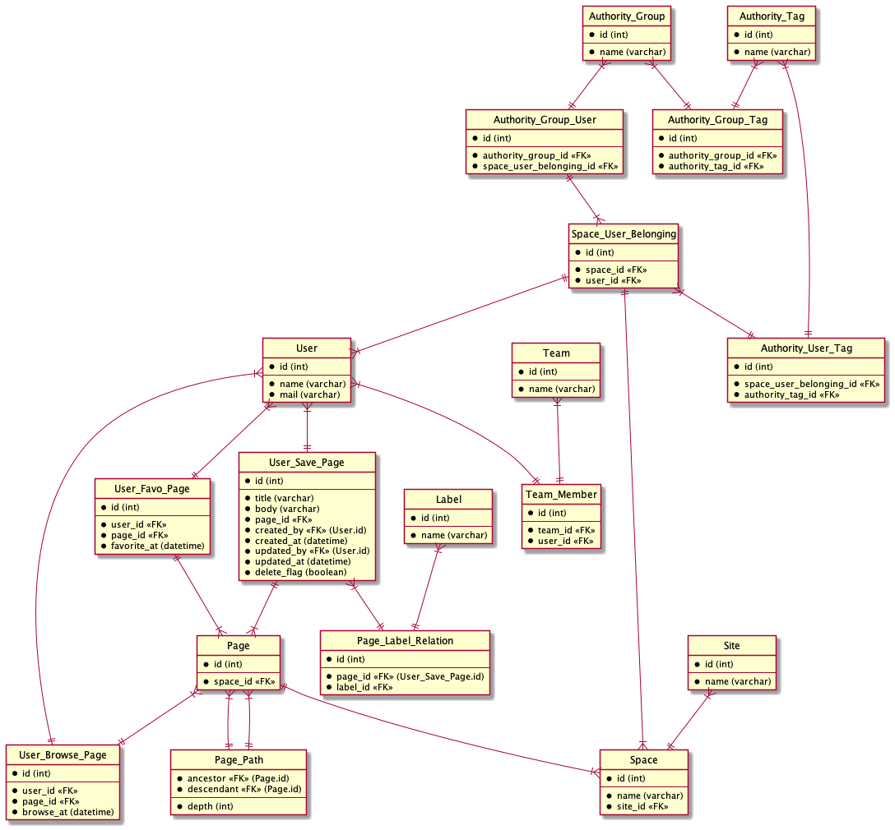

# DB モデリング 3

## 課題内容

[airtable](https://airtable.com/tblTnXBXFOYJ0J7lZ/viwyi8muFtWUlhNKG/recQgEc0Z8Ic0AzLQ?blocks=hide)

---

## 課題 1

作っては直してを繰り返したので、まずは最終系を公開します。



```wsd
entity User_Save_Page {
  *id (int)
  --
  *title (varchar)
  *body (varchar)
  *page_id <<FK>>
  *created_by <<FK>> (User.id)
  *created_at (datetime)
  *updated_by <<FK>> (User.id)
  *updated_at (datetime)
  *delete_flag (boolean)
}

entity User_Browse_Page {
  *id (int)
  --
  *user_id <<FK>>
  *page_id <<FK>>
  *browse_at (datetime)
}

entity User_Favo_Page {
  *id (int)
  --
  *user_id <<FK>>
  *page_id <<FK>>
  *favorite_at (datetime)
}

entity User {
  *id (int)
  --
  *name (varchar)
  *mail (varchar)
}

entity Team {
  *id (int)
  --
  *name (varchar)
}

entity Team_Member {
  *id (int)
  --
  *team_id <<FK>>
  *user_id <<FK>>
}

entity Site {
  *id (int)
  --
  *name (varchar)
}

entity Space {
  *id (int)
  --
  *name (varchar)
  *site_id <<FK>>
}

entity Page {
  *id (int)
  --
  *space_id <<FK>>
}

entity Page_Path {
  *ancestor <<FK>> (Page.id)
  *descendant <<FK>> (Page.id)
  --
  *depth (int)
}

entity Space_User_Belonging {
  *id (int)
  --
  *space_id <<FK>>
  *user_id <<FK>>
}

entity Label {
  *id (int)
  --
  *name (varchar)
}

entity Page_Label_Relation {
  *id (int)
  --
  *page_id <<FK>> (User_Save_Page.id)
  *label_id <<FK>>
}

entity Authority_Group {
  *id (int)
  --
  *name (varchar)
}

entity Authority_Tag {
  *id (int)
  --
  *name (varchar)
}

entity Authority_Group_Tag {
  *id (int)
  --
  *authority_group_id <<FK>>
  *authority_tag_id <<FK>>
}

entity Authority_Group_User {
  *id (int)
  --
  *authority_group_id <<FK>>
  *space_user_belonging_id <<FK>>
}

entity Authority_User_Tag {
  *id (int)
  --
  *space_user_belonging_id <<FK>>
  *authority_tag_id <<FK>>
}
```

### 仕様

- 追加対象項目
  - Site/Space/Page
  - Team
  - Authority
- 対象外
  - ブログ
  - コメント
- 階層構造の変更履歴を保存しない

### モデリング結果の説明

#### イベント系

- 「ユーザー」が「ページ」を「更新」する
- 「ユーザー」が「ページ」を「閲覧」する
- 「ユーザー」が「ページ」を「スター」する

#### リソース系

- イベント系以外のテーブル

#### 具体例

Site

| id  | name  |
| --- | ----- |
| 1   | PrAha |

---

Space

| id  | name | site_id |
| --- | ---- | ------- |
| 1   | Biz  | 1       |
| 2   | Dev  | 1       |
| 3   | Ops  | 1       |

---

Page

| id  | space_id |
| --- | -------- |
| 1   | 2        |
| 2   | 2        |
| 3   | 2        |
| 4   | 1        |

---

Page_Path

| ancestor | descendant | depth |
| -------- | ---------- | ----- |
| 1        | 2          | 1     |
| 1        | 3          | 1     |
| 1        | 1          | 0     |
| 2        | 2          | 0     |
| 3        | 3          | 0     |
| 4        | 4          | 0     |

---

User

| id  | name            | email             |
| --- | --------------- | ----------------- |
| 1   | Tsubasa Nakano  | nakano@docomo     |
| 2   | Tatsuya Sasaki  | sasaki@au         |
| 3   | Koichi Furukawa | furukawa@softbank |

---

Space_User_Belonging

| id  | space_id | user_id |
| --- | -------- | ------- |
| 1   | 2        | 1       |
| 2   | 2        | 2       |
| 3   | 2        | 3       |

---

Team

| id  | name  |
| --- | ----- |
| 1   | team1 |

---

Team_Member

| id  | team_id | user_id |
| --- | ------- | ------- |
| 1   | 1       | 1       |
| 2   | 1       | 2       |
| 3   | 1       | 3       |

---

User_Browse_Page

| id  | user_id | page_id | browsed_at          |
| --- | ------- | ------- | ------------------- |
| 1   | 3       | 1       | 2021-06-01 00:00:00 |
| 2   | 3       | 2       | 2021-06-01 00:00:00 |
| 3   | 3       | 3       | 2021-06-01 00:00:00 |
| 4   | 3       | 4       | 2021-06-01 00:00:00 |
| 5   | 1       | 1       | 2021-06-01 12:00:00 |
| 6   | 1       | 2       | 2021-06-01 12:30:00 |
| 7   | 2       | 1       | 2021-06-01 13:00:00 |

---

User_Favo_Page

| id  | user_id | page_id | favorite_at         |
| --- | ------- | ------- | ------------------- |
| 1   | 1       | 1       | 2021-06-01 12:00:00 |
| 2   | 1       | 2       | 2021-06-01 12:30:00 |
| 3   | 2       | 1       | 2021-06-01 13:00:00 |

---

User_Save_Page

| id  | title                | body                          | page_id | created_by | created_at          | updated_by | updated_at          | delete_flag |
| --- | -------------------- | ----------------------------- | ------- | ---------- | ------------------- | ---------- | ------------------- | ----------- |
| 1   | Initialize           |                               | 1       | 3          | 2021-06-01 00:00:00 | 3          | 2021-06-01 00:00:00 | false       |
| 2   | PC Setup             |                               | 2       | 3          | 2021-06-01 00:00:00 | 3          | 2021-06-01 00:00:00 | false       |
| 3   | Get AWS Account      |                               | 3       | 3          | 2021-06-01 00:00:00 | 3          | 2021-06-01 00:00:00 | false       |
| 4   | Regist Company Email |                               | 4       | 3          | 2021-06-01 00:00:00 | 3          | 2021-06-01 00:00:00 | false       |
| 5   | Initialize           | This Page is First Look Page. | 1       | 3          | 2021-06-01 00:00:00 | 1          | 2021-06-01 12:00:00 | false       |
| 6   | PC Setup             | git clone repo                | 2       | 3          | 2021-06-01 00:00:00 | 1          | 2021-06-01 12:30:00 | false       |

---

Label

| id  | name  |
| --- | ----- |
| 1   | Setup |
| 2   | AWS   |

---

Page_Label_Relation

| id  | page_id | label_id |
| --- | ------- | -------- |
| 1   | 1       | 1        |
| 2   | 2       | 1        |
| 3   | 3       | 1        |
| 4   | 3       | 2        |

---

Authority_Tag

| id  | name        |
| --- | ----------- |
| 1   | All Display |
| 2   | Create Page |
| 3   | Delete Page |

---

Authority_Group

| id  | name             |
| --- | ---------------- |
| 1   | administorators  |
| 2   | confluence-users |
| 3   | site-admins      |

---

Authority_Group_Tag

| id  | authority_group_id | authority_tag_id |
| --- | ------------------ | ---------------- |
| 1   | 1                  | 1                |
| 2   | 1                  | 2                |
| 3   | 1                  | 3                |
| 4   | 2                  | 1                |
| 5   | 2                  | 2                |
| 6   | 3                  | 1                |

---

Authority_User_Tag

| id  | space_user_belonging_id | authority_tag_id |
| --- | ----------------------- | ---------------- |
| 1   | 3                       | 2                |

---

Authority_Group_Tag

| id  | authority_group_id | space_user_belonging_id |
| --- | ------------------ | ----------------------- |
| 1   | 1                  | 1                       |
| 2   | 2                  | 2                       |
| 3   | 3                  | 3                       |

### ユースケース

1. いつ、誰が、どんなテキスト情報を保存したのか分かる
2. Page の 編集履歴を辿れて、n 個前のテキスト情報を確認することができる
3. ある Page の親ページが分かる
4. ある Page の子ページが分かる
5. Page の階層構造は変更可能
6. Page には自由に何個でもラベルを付与することができる
7. 同じラベルの Page を取得することができる
8. Page にスターをつけることができる
9. Site ホームでスターがついた Page を取得することができる
10. Space の全ての Page を取得することができる
11. Site ホームで最近表示した Page を取得することができる
12. Site ホームで作業済み Page を取得することができる
13. Team を作成することができる
14. 自分が所属しているチームがわかるし、チームメンバーを取得することができる
15. ライセンスグループごとに権限を付与できる
16. ユーザーは必ずライセンスグループに所属している
17. ユーザーごとに権限を付与できる

## 疑問

- Authority_Group_User や Authority_User_Tag には Space_User_Belonging_id を参照させているが、大丈夫？ Space_id と User_id をそれぞれ持たせた方が良い？

## メモ

- 基本的に、Confluence は全て階層構造で表現できる
  - テーブル設計では、すべての階層構造を管理するテーブルを１つにまとめるか否か。
  - 今回は Page のみ階層構造でモデリング
- Page に対する updated_at/updated_by の履歴を保存したい
  - そのため、イミュータブルな形式を採用
- 「あるページ」が「あるページ」を参照している状態を実現したい
  - 双方向ではなく一方向
  - Reference テーブルを作成しようとしたが、やめた。
  - Page の body の中で HyperLink を持たせれば良い気がする
- Page テーブルに created_by を持たせていたが、削除して User_Save_Page に移譲した。Factory パターンみたいにしたかった
  - その後、Page テーブルは Space_id カラムを追加した。Space_id カラムは不変。
  - created_by, created_at は Page テーブルの方が良いかな？
