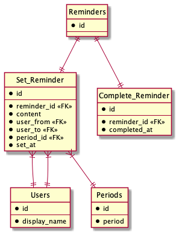

# DB モデリング 4

## 課題内容

[airtable](https://airtable.com/tblTnXBXFOYJ0J7lZ/viwyi8muFtWUlhNKG/reckOBNlLbwf5m8ut?blocks=hide)

---

## 課題 1

### ユースケース

1. 「ユーザー」が「他のユーザー」に「リマインダー」を「設定」する
2. 「/penpen-list と入力する」と「自分宛のタスク」を「表示」できる
3. 「/penpen-outgoing と入力する」と「自分が設定したタスク一覧」を「表示」できる
4. 「終わったボタンをクリック」すると「リマインダー」が「終了」する
5. 「終わったボタンをクリック」すると「リマインダーを設定したユーザー」に「完了報告」をする
6. リマインダーの周期は n 時間毎に設定できる
7. リマインダーの周期は n 日毎に設定できる
8. リマインダーの周期は 毎週 x 曜日毎に設定できる
9. リマインダーの周期は n 週間に 1 度毎と設定できる
10. リマインダーの周期は 毎月 n 日毎と設定できる
11. リマインダーの文面を指定可能

### 作業ステップ

1. イベントを見つける

- 「ユーザー」が「他のユーザー」に「リマインダーを設定」する
- 「終わったボタンをクリック」すると「リマインダー」が「終了」する
- ~~「終わったボタンをクリック」すると「リマインダーを設定したユーザー」に「完了報告」をする~~

```wsd
entity Set_Reminder {}
entity Complete_Reminder {}
```

2. リソースを見つける

```wsd
entity Reminders {}
entity Users {}
entity Periods {}
```

3. スキーマの項目を埋める

```wsd
entity Set_Reminder {
  *id
  --
  *reminder_id <<FK>>
  *set_at
}
entity Complete_Reminder {
  *id
  --
  *reminder_id <<FK>>
  *completed_at
}

entity Reminders {
  *id
  --
  *content
  *user_from <<FK>>
  *user_to <<FK>>
  *period_id <<FK>>
}
entity Users {
  *id
  --
  *display_name
}
entity Periods {
  *id
  --
  *period
}
```

修正

```wsd
entity Set_Reminder {
  *id
  --
  *reminder_id <<FK>>
  *content
  *user_from <<FK>>
  *user_to <<FK>>
  *period_id <<FK>>
  *set_at
}

entity Complete_Reminder {
  *id
  --
  *reminder_id <<FK>>
  *completed_at
}

entity Reminders {
  *id
  --
}

entity Users {
  *id
  --
  *display_name
}

entity Periods {
  *id
  --
  *period
}
```

4. リレーションの設定



### 疑問

- Reminders に削除フラグを持たせることで、Reminders, User, Period の 3 テーブルだけでも実現できそう
  - わざわざイベントテーブルを作る必要があったのかな？
- 「とりあえず論理削除」がまずいということで、論理削除を排除した設計を考えてみたが、これで良いのだろうか？
- 完了テーブルよりも履歴テーブルにしたようが良い？

### メモ

- Display_Name(@Koichi Furukawa) は、被るかもしれない?
- WorkSpace を超えたタスクは表示しない?
- リマインダーのステート管理どうするんだ？
- Reminder の作成・削除をどのように表現するか
