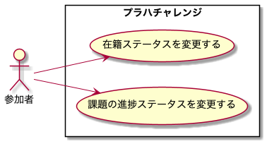
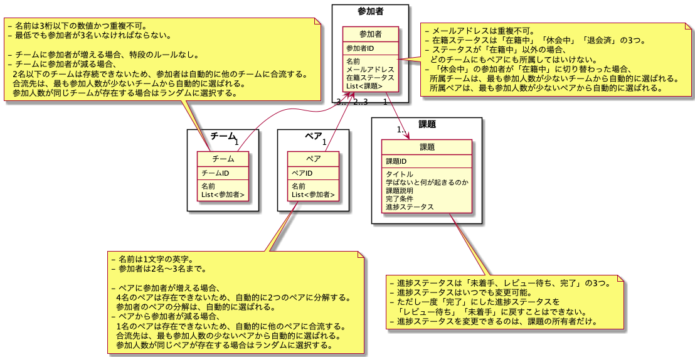

# 特大課題：プラハチャレンジを DDD で実装してみる

## 課題内容

[airtable](https://airtable.com/tblTnXBXFOYJ0J7lZ/viwyi8muFtWUlhNKG/recvJUwXFfnhvKe7F?blocks=hide)

---

## 課題 1

### 手順

1. ユースケース図作成
2. ドメインモデル図作成
   1. エンティティの作成
   2. ドメイン知識（ルール、制約）をドメインモデルに吹き出しの形で表現
   3. 集約の境界を決める

### 1. ユースケース図作成

### 2. ドメインモデル図作成

