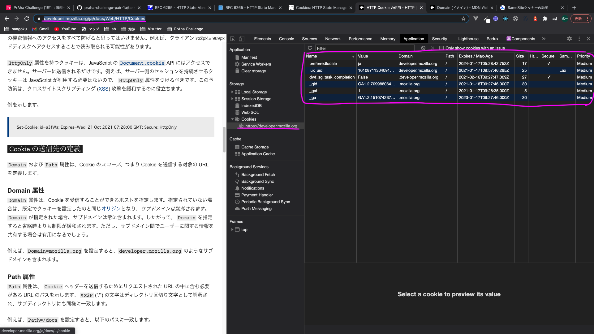
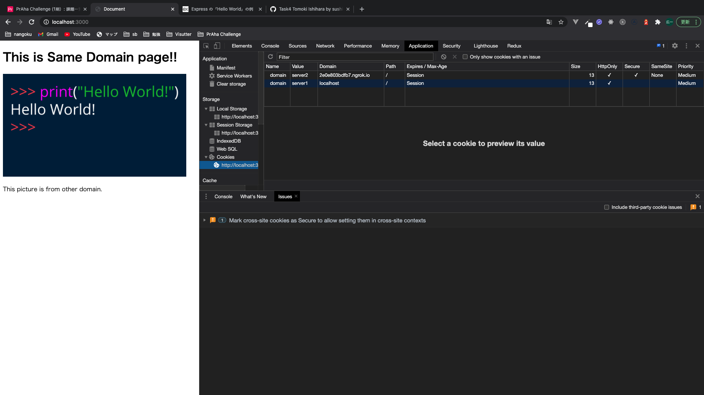

# サードパーティクッキーについて理解する
## 問題
[airtable](https://airtable.com/tblTnXBXFOYJ0J7lZ/viwyi8muFtWUlhNKG/recmQLSaOpAgZOkVm?blocks=hide)

## 課題1(質問)
### 1
- 前提
    - Cookie はドメインに関連付けられる。
- ファーストパーティクッキーとは
    - Cookie のドメインが現在閲覧しているページのドメインと**同じ**である場合、その Cookie をファーストパーティクッキーと呼ぶ。
- サードパーティクッキーとは
    - Cookie のドメインが現在閲覧しているページのドメインと**異なる**である場合、その Cookie をサードパーティクッキーと呼ぶ。
- ファーストパーティクッキーとサードパーティクッキーの違い
    - Cookie のドメインが、現在閲覧しているページのドメインと同じか否か。


[What are first-party and third-party cookies? | web.dev](https://web.dev/samesite-cookies-explained/#what-are-first-party-and-third-party-cookies) (直感的に理解しやすい画像だったので引用)

#### Refferences
- [サードパーティの Cookie | MDN Web Docs](https://developer.mozilla.org/ja/docs/Web/HTTP/Cookies#third-party_cookies)
- [ウェブのプライバシー強化: サードパーティ Cookie 廃止への道 | Google Developers](https://developers-jp.googleblog.com/2020/01/cookie.html)
- [What are first-party and third-party cookies? | web.dev](https://web.dev/samesite-cookies-explained/#what-are-first-party-and-third-party-cookies)
- [7.1.  Third-Party Cookies | RFC6265](https://tools.ietf.org/html/rfc6265#section-7.1)

#### 疑問
- `https://developer.mozilla.org/ja/docs/Web/HTTP/Cookies` で確認できる Cookie はそれぞれファーストパーティクッキーかサードパーティクッキーか?

    

    特に、`.mozilla.org`から発行されているCookieが、ファーストパーティクッキーかサードパーティクッキーかわからない。

    つまり、`b.a.com` から見た `a.com` は同じドメインか否か。という問題に帰着する。

    @中野さんの回答にはbase domainが同じならば、ファーストパーティクッキー であると記述されていた。ソースを聞こうかな。

### 2
- どのように把握しているか
    - 広告バナーやJavaScriptからサードパーティクッキーを読み込みことで、サイトをまたいで同じクッキーを送信することを可能にし、ユーザの訪問履歴を把握している。
- 例
    1. `site.com` と `other.com` は共に、Google AdSence `ads.com` への広告タグを含むサイトである。
    2. `site.com` へのアクセス時、`ads.com` のサーバーに広告コンテンツをリクエストする。
    3. `ads.com` のサーバーは `site.com` に広告コンテンツを配信(レスポンス)する際に、レスポンスヘッダーに`Set-Cookie: id=123` を設定する。
    4. `site.com`から`other.com`へアクセスしたとする。
    5. `other.com`へのアクセス時に、`ads.com` のサーバーに広告コンテンツをリクエストする際に、`ads.com`で取得したCookie `id=123` は同じドメインなので、リクエストヘッダーにセットされる。
#### Refferences
- [付録: サードパーティ Cookie | JAVASCRIPT.INFO](https://ja.javascript.info/cookie#ref-138)
    - 図があるので直感的に理解できます。
- [サードパーティクッキーの使い方・使い分けまとめメモ](https://kimagureneet.hatenablog.com/entry/2016/02/11/104614)
    - Googleアナリティクス形式のクッキーは、ファーストパーティクッキー。
        - クッキーが発行されるサイトは、アナリティクスのタグを仕込むサイトとなるため。
    - 広告用トラッキングタグ形式のクッキーは、サードパーティクッキー。
        - クッキーが発行されるサイトは、広告用トラッキング情報を収集するサーバーとなるため。
- [AdSense が Cookie を使用する仕組み | AdSenseヘルプ](https://support.google.com/adsense/answer/7549925?hl=ja#:~:text=%E5%BA%83%E5%91%8A%E3%81%8C%E8%A1%A8%E7%A4%BA%E3%81%BE%E3%81%9F%E3%81%AF%E3%82%AF%E3%83%AA%E3%83%83%E3%82%AF,%E3%83%96%E3%83%A9%E3%82%A6%E3%82%B6%E3%81%AB%E4%BF%9D%E5%AD%98%E3%81%95%E3%82%8C%E3%81%BE%E3%81%99%E3%80%82)

### 3
#### Refferences
### 4
#### Refferences
### 5
- 回答
    - ファーストパーティクッキー
#### Refferences
- [サードパーティの Cookie](https://developer.mozilla.org/ja/docs/Web/HTTP/Cookies#third-party_cookies)
    - > Cookie はドメインに関連付けられます。
## 課題2(実装)
ページの読み込みと同時に、ファーストパーティクッキーと、サードパーティクッキーが設定されるようなWEBサイトのデモ



### Usage
#### Prerequisites
開発マシンに以下の前提条件がすべてインストールされていることを確認してください。

- Git
- Node.js
- ngrok

#### Run Application
1. server1

    ```bash
    $ cd server1
    $ npm init
    $ yarn start
    ```

2. server2

    ```bash
    $ cd server2
    $ npm init
    $ yarn start
    $ ngrok http 3001
    ```

#### Refferences
1. [Express での静的ファイルの提供 | Express](https://expressjs.com/ja/starter/static-files.html)
2. [Documentation | ngrok](https://ngrok.com/docs)