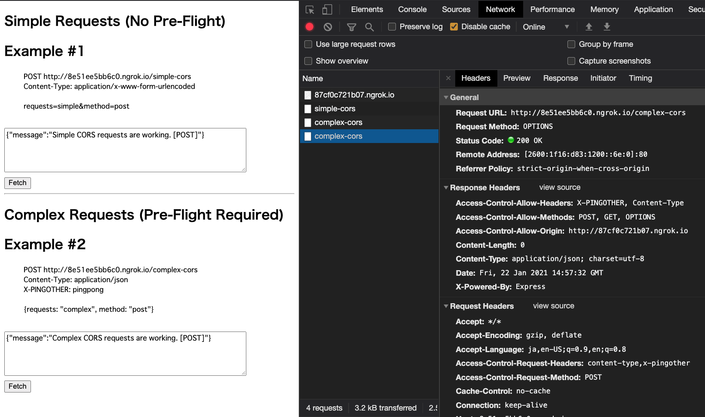

# CORSを説明するためのモック
## 課題3(実装)

`gif`


`画像`


### Usage
#### Prerequisites
開発マシンに以下の前提条件がすべてインストールされていることを確認してください。

- Git
- Node.js
- ngrok

#### Run Application

1. cors-client

    ```bash
    $ cd cors-client
    $ npm init
    $ yarn start
    $ ngrok http 3000
    ```
    ngrokで取得したurl を cors-serverの`index.js 5行目` に代入してください。(すみません；；)
    
2. cors-server

    ```bash
    $ cd cors-server
    $ npm init
    $ yarn start
    $ ngrok http 3001
    ```
    ngrokで取得したurl を cors-clientの`index.html 56行目` に代入してください。(すみません；；)

#### Refferences
1. [オリジン間リソース共有 (CORS) | MDN Web Docs](https://developer.mozilla.org/ja/docs/Web/HTTP/CORS)
2. [Documentation | ngrok](https://ngrok.com/docs)
3. [cors | Express](https://expressjs.com/en/resources/middleware/cors.html)
4. [node-cors-client | Github](https://github.com/troygoode/node-cors-client)
5. [node-cors-server | Github](https://github.com/troygoode/node-cors-server)
6. [Fetch の使用 | MDN Web Docs](https://developer.mozilla.org/ja/docs/Web/API/Fetch_API/Using_Fetch)

---

## 課題4(成果物に関する質問)
### 1.
1. POST リクエスト

    `curl -v -X POST -d '{"requests": "complex", "method": "post"}' -H "Content-Type: application/json" -H "X-PINGOTHER: pingpong" -H "Origin: http://localhost:80" http://13f53033a74c.ngrok.io/complex-cors`

    ```
    *   Trying 2600:1f16:d83:1201::6e:4...
    * TCP_NODELAY set
    * Connected to 13f53033a74c.ngrok.io (2600:1f16:d83:1201::6e:4) port 80 (#0)
    > POST /complex-cors HTTP/1.1
    > Host: 13f53033a74c.ngrok.io
    > User-Agent: curl/7.64.1
    > Accept: */*
    > Content-Type: application/json
    > X-PINGOTHER: pingpong
    > Origin: http://localhost:80　                             // Origin!!!
    > Content-Length: 41
    > 
    * upload completely sent off: 41 out of 41 bytes
    < HTTP/1.1 200 OK                                           // OKになる
    < Access-Control-Allow-Origin: http://87cf0c721b07.ngrok.io // なぜ??
    < Content-Length: 55
    < Content-Type: application/json; charset=utf-8
    < Date: Fri, 22 Jan 2021 16:01:00 GMT
    < Etag: W/"37-1QTsUsTC4ogFBNX+hSBbSq7yaIg"
    < X-Powered-By: Express
    < 
    * Connection #0 to host 13f53033a74c.ngrok.io left intact
    {"message":"Complex CORS requests are working. [POST]"}
    * Closing connection 0
    ```
2. POST リクエスト

    `curl -v -X POST -d '{"requests": "complex", "method": "post"}' -H "Content-Type: application/json" -H "X-PINGOTHER: pingpong" -H "Origin: http://localhost:8080" http://13f53033a74c.ngrok.io/complex-cors`
    ```
    Note: Unnecessary use of -X or --request, POST is already inferred.
    *   Trying 2600:1f16:d83:1201::6e:4...
    * TCP_NODELAY set
    * Connected to 13f53033a74c.ngrok.io (2600:1f16:d83:1201::6e:4) port 80 (#0)
    > POST /complex-cors HTTP/1.1
    > Host: 13f53033a74c.ngrok.io
    > User-Agent: curl/7.64.1
    > Accept: */*
    > Content-Type: application/json
    > X-PINGOTHER: pingpong
    > Origin: http://localhost:8080                             // Originを変えてみた
    > Content-Length: 41
    > 
    * upload completely sent off: 41 out of 41 bytes
    < HTTP/1.1 200 OK                                           // OKになる
    < Access-Control-Allow-Origin: http://87cf0c721b07.ngrok.io // なぜ??
    < Content-Length: 55
    < Content-Type: application/json; charset=utf-8
    < Date: Fri, 22 Jan 2021 16:02:10 GMT
    < Etag: W/"37-1QTsUsTC4ogFBNX+hSBbSq7yaIg"
    < X-Powered-By: Express
    < 
    * Connection #0 to host 13f53033a74c.ngrok.io left intact
    {"message":"Complex CORS requests are working. [POST]"}
    * Closing connection 0
    ```

### 2.
```
2パターン試したが、どちらもCORS制約が適用されていないように見える。

そもそも Simple Requests に該当しない場合は、POSTリクエストの前にOPTIONSリクエストを送る必要があるのにも関わらず、正常なレスポンスが返ってくる。
```

- OPTIONS リクエストを試してみる

    `curl -v -X OPTIONS -H "Content-Type: application/json" -H "Access-Control-Request-Method: POST" -H "Access-Control-Request-Headers: content-type, x-pingother" -H "Origin: http://localhost:8080" http://0c7dda8555d3.ngrok.io/complex-cors`

    ```
    *   Trying 2600:1f16:d83:1202::6e:5...
    * TCP_NODELAY set
    * Connected to 0c7dda8555d3.ngrok.io (2600:1f16:d83:1202::6e:5) port 80 (#0)
    > OPTIONS /complex-cors HTTP/1.1
    > Host: 0c7dda8555d3.ngrok.io
    > User-Agent: curl/7.64.1
    > Accept: */*
    > Content-Type: application/json
    > Access-Control-Request-Method: POST
    > Access-Control-Request-Headers: content-type, x-pingother
    > Origin: http://localhost:8080                             // Origin!!!
    > 
    < HTTP/1.1 204 No Content                                   // 成功
    < Access-Control-Allow-Headers: X-PINGOTHER, Content-Type
    < Access-Control-Allow-Methods: POST, GET, OPTIONS
    < Access-Control-Allow-Origin: http://b15a91639b5f.ngrok.io // なぜ??
    < Date: Sat, 23 Jan 2021 02:47:54 GMT
    < X-Powered-By: Express
    < 
    * Connection #0 to host 0c7dda8555d3.ngrok.io left intact
    * Closing connection 0
    ```

    OPTIONS -> POST を同一コネクションで実施すれば良い??(見当違いかな?)

### 3.
```
わからないぞ、、

curl リクエスト時のOriginヘッダーは、何になるのだろうか?
-H オプションで指定しているが、意味ないのかな??

それか、user-agent: curl/* の場合はcors制約に該当しない?
```