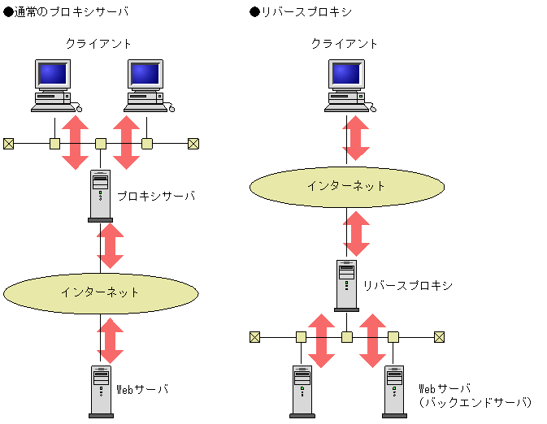

# キャッシュについて理解する
## 課題内容
[airtable](https://airtable.com/tblTnXBXFOYJ0J7lZ/viwyi8muFtWUlhNKG/recoJOv7Mr2ur4Vn1?blocks=hide)

## 課題1(質問)
### 1. 
- **キャッシュが必要な理由**

  ```
  クライアント・サーバー間の通信時間よりも、クライアント・キャッシュ間の通信時間の方が短い。
  そのため頻繁に利用する情報に関しては、キャッシュを利用した方がクライアントにレスポンスを早く返せるからである。
  ```

---

### 2. 
- **キャッシュの種類**

  - キャッシュのカテゴリ
    ```
    プライベートキャッシュ と 共有キャッシュ の2つのカテゴリーに大別できる。
    ```
    [さまざまな種類のキャッシュ | MDN Web Docs](https://developer.mozilla.org/ja/docs/Web/HTTP/Caching#different_kinds_of_caches)

  - ブラウザキャッシュ
    ```
    プライベートキャッシュに該当する。
    特徴は、ブラウザにキャッシュ領域が存在する点である。
    ```

  - プロキシキャッシュ
    ```
    共有キャッシュに該当する。
    特徴は、プロキシサーバーにキャッシュ領域が存在する点である。
    ```
    [キャッシュのしくみ | Oracle](https://docs.oracle.com/cd/E19528-01/820-0863/adyml/index.html)
  
  - リバースプロキシのキャッシュ
    ```
    共有キャッシュに該当する。
    特徴は、リバースプロキシサーバーにキャッシュ領域が存在する点である。
    ```

#### メモ
- キャッシュメモリ
  ```
  主記憶装置とCPUなど処理装置との間に構成される。

  実はキャッシュメモリは1段だけではなく、多段構造になっている。
  CPU <-> L1キャッシュ <-> L2キャッシュ, L3キャッシュ <-> 主記憶装置

  ※ プロセッサによっては、L3キャッシュを持たないものもある。
  ※ 2013年時点ではL4キャッシュまでCPUに内蔵する例も存在する。
  ```
  [キャッシュメモリ | Wikipedia](https://ja.wikipedia.org/wiki/%E3%82%AD%E3%83%A3%E3%83%83%E3%82%B7%E3%83%A5%E3%83%A1%E3%83%A2%E3%83%AA)

- プロキシとリバースプロキシの違い
  ```
  設置場所が違う。

  プロキシサーバ
    クライアント → プロキシサーバ → インターネット → Webサーバ
  
  プロキシサーバ
    クライアント → インターネット → リバースプロキシサーバ → Webサーバ
  ```
  [4.7　リバースプロキシの設定](http://itdoc.hitachi.co.jp/manuals/3020/30203U1720/EU170054.HTM)
  

---

### 3. 
- **それぞれの役割**
  - Cache-Control ヘッダー

    Cache-Control ヘッダーの役割
    ```
    リクエスト・レスポンスでキャッシュのディレクティブ(指示)を定義すること。
    ```
    
    ディレクティブの種類
    | ディレクティブ    | 説明 |
    | --------------- | --- |
    | no-store        | キャッシュしない |
    | no-cache        | キャッシュするが再検証する |
    | public          | 常に全てをキャッシュする |
    | private         | 共有キャッシュには保存しない <br> ただしブラウザのプライベートキャッシュには保存できる |
    | max-age         | キャッシュの有効期限 (秒数) |
    | must-revalidate | キャッシュが期限切れだった場合、オリジンサーバで検証しないと有効期限切れのキャッシュを利用できない |

    [Cache-Control ヘッダー | MDN Web Docs](https://developer.mozilla.org/ja/docs/Web/HTTP/Caching#the_cache-control_header)

  - Expires ヘッダー

    Expires ヘッダーの役割
    ```
    レスポンスのリソースの有効期限を定義すること。
    ```
    [Expires | MDN Web Docs](https://developer.mozilla.org/ja/docs/Web/HTTP/Headers/Expires)

    優先順位

      `Cache-Control: max-age=<seconds> または Cache-Control: s-maxage=<seconds>` **>** `Expires: <http-date>`
    > レスポンスに max-age または s-maxage ディレクティブを持つ Cache-Control ヘッダーがある場合、Expires ヘッダーは無視されます。
    

  - Pragma ヘッダー

    Pragma ヘッダーの役割
    ```
    Cache-Control ヘッダーの下位互換。
    HTTP/1.0 でのキャッシュ時に利用する。

    ※ HTTP/1.0 クライアントとの下位互換性のためにのみ使用すること。
    ```
    [Pragma | MDN Web Docs](https://developer.mozilla.org/ja/docs/Web/HTTP/Headers/Pragma)

---

### 4. 
- **最大容量**
  - Chrome
    ```
    a
    ```
  
  - Safari
    ```
    a
    ```
  
  - Firefox
    ```
    a
    ```

  - Edge
    ```
    a
    ```
- **上限を超えたときの挙動**
  ```
  a
  ```

---

### 5. 
- **動的なサイトのキャッシュには、expires ヘッダーを利用しない方が良い理由**
  ```
  ユーザーエージェントによって、配信リソースが異なる場合について考える。
  例えば、PC用とスマートフォン用の配信リソースなどである。

  expires ヘッダーの役割は、レスポンスのリソースの有効期限を定義することである。
  そのため、異なるユーザーエージェントに対するキャッシュ利用の判断ができないからである。
  ```
  [変化するレスポンス | MDN Web Docs](https://developer.mozilla.org/ja/docs/Web/HTTP/Caching#varying_responses)

- **どうすればよいか**
  ```
  vary レスポンスヘッダーを利用する。

  上記の例の場合は、Vary: User-Agent レスポンスヘッダーを返す。
  ```

#### メモ
- [動的な配信 | Google検索セントラル](https://developers.google.com/search/mobile-sites/mobile-seo/dynamic-serving?hl=ja)

  確かにユーザーエージェントの検出間違いやすそう、、
  > 一般に、ユーザーエージェントの検出（ユーザーエージェントの「スニッフィング」と呼ばれることもあります）は、エラーが発生しやすい処理です。

- [Varyヘッダとキャッシュについて](https://kiririmode.hatenablog.jp/entry/20170626/1498402800)
  
  Vary ヘッダがなかったらどうなるか について記述してあり、理解しやすかったです。

  > 1. クライアント A から Accept-Encoding: gzip つきのリクエストが送信され、サーバは gzip 圧縮されたコンテンツを返す。これがキャッシュサーバにキャッシュされる。 <br>
  > 2. gzip を理解しないクライアント B が同じ URL にリクエストを発行する (Accept-Encoding ヘッダは含まれていない) と、キャッシュサーバが gzip 圧縮されたキャッシュを返す

---

### 6. 
- **hoge**

  ```
  hoge
  ```
  []()

---

## 課題2 (実装)

[README.md](./cache-mock/README.md)

---

## 課題3 (成果物に関する質問)
- ケース1
  - どんなサービスの？
    - Amazon
  - どんなページで？
    - トップページ
  - どんなファイルを？
    - 広告配信用のファイル
  - なぜキャッシュしてはいけないのでしょうか？
    - 広告配信結果は動的に変わるから?

- ケース2
  - どんなサービスの？
    - Amazon
  - どんなページで？
    - トップページ
  - どんなファイルを？
    - htmlファイル
  - なぜキャッシュしてはいけないのでしょうか？
    - トップページなどのhtmlファイルは動的だから

- ケース3
  - どんなサービスの？
    - Amazon
  - どんなページで？
    - トップページ
  - どんなファイルを？
    - query parameter 付きのリクエストのレスポンス結果
  - なぜキャッシュしてはいけないのでしょうか？
    - query parameter の値が動的に変わるから?


## 課題4 (クイズ)
### クイズ1

一般的にどちらの方が早いでしょうか?

1. キャッシュのレスポンス
    ```
    browser <- resource cache
    ```
2. キャッシュ検証
    ```
    browser <-cache validation- server
    ```

<details><summary>回答</summary><div>

```
キャッシュのレスポンス
```
- [ETag example | web.dev](https://web.dev/http-cache/)
  > If there's a match, then the server can respond with a 304 Not Modified HTTP response, which is the equivalent of "Hey, keep using what you've already got!" There's very little data to transfer when sending this type of response, so it's usually much faster than having to actually send back a copy of the actual resource being requested.

  304レスポンスは転送のデータが少ないから、実際のレスポンスよりも遥かに高速!!
  ただし、キャッシュレスポンスは0に近い！！

</div></details>

### クイズ2
キャッシュの検証に用いられる `ETag` レスポンスヘッダーと `Last-Modified` レスポンスヘッダーの違いは何でしょう?

<details><summary>回答</summary><div>

```
比較対象が異なる。

ETag レスポンスヘッダーはIDによる比較。
Last-Modified レスポンスヘッダーは日時による比較。
```

</div></details>
