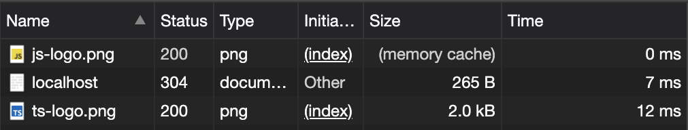

# CORSを説明するためのモック
## 課題2(実装)

初回以降 (初回アクセスから`Cache-Control: max-age=n`で設定した秒数以内)


### Usage
#### Prerequisites
開発マシンに以下の前提条件がすべてインストールされていることを確認してください。

- Git
- Node.js

#### Run Application

```bash
$ npm init
$ yarn start
```

#### Refferences
1. [HTTP キャッシュ | MDN Web Docs](https://developer.mozilla.org/ja/docs/Web/HTTP/Caching)
2. [Express での静的ファイルの提供 | Express](https://expressjs.com/ja/starter/static-files.html)
3. [express.static(root, [options])](https://expressjs.com/en/4x/api.html#express.static)